database.properties
```properties
jdbc.driver=com.mysql.jdbc.Driver
jdbc.url=jdbc:mysql://127.0.0.1:3306/smarthomesystemdatabase?useSSL=false&useUnicode=true&characterEncoding=utf-8
jdbc.username=root
jdbc.password=...

```

# 流程

1. 网页端新建一个设备

   选择产品类型：light(灯光)、sensor(传感器)、camera(摄像头)、alarm(报警器)、relay(继电器)

   填写设备名称：唯一标识（不能有中文）

   备注：。。。

2. 服务器端操作数据库，添加一条数据（一个设备）

3. 用户把唯一标识烧入单片机

   在单片机固件程序中，拼接url，实现请求发送、请求解析

* 如果添加的设备为camera

  需要有个Controller接收数据：/camera/stream/{cameraId}

  在服务器端的controller里，添加一个静态列表变量：List<ByteArrayOutputStream>，通过 cameraId 找到对应摄像头存储输出流的索引位置

  cameraId 同样是camera表的主键 


# 数据库设计

模拟实物

## user表

业主信息

id：主键

username：用户名

password：密码

```sql
CREATE TABLE `user` (
  `id` int(10) unsigned NOT NULL AUTO_INCREMENT COMMENT '主键',
  `username` varchar(20) NOT NULL COMMENT '用户名',
  `password` varchar(20) NOT NULL COMMENT '密码',
  PRIMARY KEY (`id`),
  UNIQUE KEY `username` (`username`)
) ENGINE=InnoDB DEFAULT CHARSET=utf8
```


## room表

房间表，用来记录某个房间有哪些传感器

id：主键

name：房间名字

ownerId：（外键）用户id

```sql
CREATE TABLE `room` (
  `id` int(10) unsigned NOT NULL AUTO_INCREMENT COMMENT '主键',
  `name` varchar(20) NOT NULL COMMENT '房间名字',
  `ownerId` int(11) NOT NULL COMMENT '用户id（外键）',
  PRIMARY KEY (`id`)
) ENGINE=InnoDB DEFAULT CHARSET=utf8


```


## light表

灯光控制

id：主键

deviceName：设备标识

remarks：备注

state：在线状态（1在线、0不在线）

switchState：开关状态（1开、0关）

roomId：房间id（外键）

```sql
CREATE TABLE `light` (
  `id` int(10) unsigned NOT NULL AUTO_INCREMENT COMMENT '主键',
  `deviceName` varchar(30) NOT NULL COMMENT '设备标识',
  `remarks` varchar(50) DEFAULT NULL COMMENT '备注',
  `state` tinyint(1) NOT NULL COMMENT '在线状态（1在线、0不在线）',
  `switchState` tinyint(1) NOT NULL COMMENT '开关状态（1开、0关）',
  `roomId` int(11) NOT NULL COMMENT '房间id（外键）',
  PRIMARY KEY (`id`)
) ENGINE=InnoDB DEFAULT CHARSET=utf8


```


## sensor表

传感器监控数据，历史数据、实时监控数据

id：主键

deviceName：设备标识

remarks：备注

state：在线状态（1在线、0不在线）


alarmThreshold：报警阈值（服务器端判断，传过来的数据超过该值时，才根据报警id，去操作报警器）

alarmId：报警器id（得有了报警器，才能配置该传感器的报警id）（外键）

roomId：房间id（外键）

```sql
CREATE TABLE `sensor` (
  `id` int(10) unsigned NOT NULL AUTO_INCREMENT COMMENT '主键',
  `deviceName` varchar(30) NOT NULL COMMENT '设备标识',
  `remarks` varchar(50) DEFAULT NULL COMMENT '备注',
  `state` tinyint(1) NOT NULL COMMENT '在线状态（1在线、0不在线）',
  `alarmThreshold` double(10,2) DEFAULT NULL COMMENT '报警阈值（服务器端判断，传过来的数据超过该值时，才根据报警id，去操作报警器）',
  `alarmId` int(11) DEFAULT NULL COMMENT '报警器id（得有了报警器，才能配置该传感器的报警id）（外键）',
  `roomId` int(11) NOT NULL COMMENT '房间id（外键）',
  PRIMARY KEY (`id`)
) ENGINE=InnoDB DEFAULT CHARSET=utf8


```


## sensorData表

传感器数据表

sensorId：外键（传感器id）

samplingTime：采样时间（datetime类型）

samplingData：采样数据

```sql
CREATE TABLE `sensordata` (
  `id` int(10) unsigned NOT NULL AUTO_INCREMENT COMMENT '主键',
  `sensorId` int(11) NOT NULL COMMENT '外键（传感器id）',
  `samplingTime` datetime NOT NULL COMMENT '采样时间（datetime类型）',
  `samplingData` double(10,2) NOT NULL COMMENT '采样数据',
  PRIMARY KEY (`id`)
) ENGINE=InnoDB DEFAULT CHARSET=utf8
```


## alarm表

传感设备发送post请求，将数据发送给服务器，服务器将数据传入数据库，并且将报警阈值取出来，判断是否超过，超过则将报警表的状态设为报警

报警表

id：主键

deviceName：设备标识

remarks：备注

state：在线状态（1在线、0不在线）

switchState：开关状态（1开、0关）

roomId：房间id（外键）

```sql
CREATE TABLE `alarm` (
  `id` int(10) unsigned NOT NULL AUTO_INCREMENT COMMENT '主键',
  `deviceName` varchar(30) NOT NULL COMMENT '设备标识',
  `remarks` varchar(50) DEFAULT NULL COMMENT '备注',
  `state` tinyint(1) NOT NULL COMMENT '在线状态（1在线、0不在线）',
  `switchState` tinyint(1) NOT NULL COMMENT '开关状态（1开、0关）',
  `roomId` int(11) NOT NULL COMMENT '房间id（外键）',
  PRIMARY KEY (`id`)
) ENGINE=InnoDB DEFAULT CHARSET=utf8

```


## alarmData表

一有报警，就存储报警时间，报警器id

alarmId：外键（报警器id）

alarmTime：报警时间

```sql
CREATE TABLE `alarmdata` (
  `id` int(10) unsigned NOT NULL AUTO_INCREMENT COMMENT '主键',
  `alarmId` int(11) NOT NULL COMMENT '外键（报警器id）',
  `alarmTime` datetime NOT NULL COMMENT '报警时间',
  PRIMARY KEY (`id`)
) ENGINE=InnoDB DEFAULT CHARSET=utf8

```


## relay表

继电器表

id：主键

deviceName：设备标识

remarks：备注

state：在线状态（1在线、0不在线）

switchState：开关状态（1开、0关）

roomId：房间id（外键）

```sql

CREATE TABLE `relay` (
  `id` int(10) unsigned NOT NULL AUTO_INCREMENT COMMENT '主键',
  `deviceName` varchar(30) NOT NULL COMMENT '设备标识',
  `remarks` varchar(50) DEFAULT NULL COMMENT '备注',
  `state` tinyint(1) NOT NULL COMMENT '在线状态（1在线、0不在线）',
  `switchState` tinyint(1) NOT NULL COMMENT '开关状态（1开、0关）',
  `roomId` int(11) NOT NULL COMMENT '房间id（外键）',
  PRIMARY KEY (`id`)
) ENGINE=InnoDB DEFAULT CHARSET=utf8
```


## camera表

摄像头数据

id：摄像头主键

deviceName：设备表示

remarks：备注

state：在线状态（1在线、0不在线）

roomId：房间id（外键）

```sql
CREATE TABLE `camera` (
  `id` int(10) unsigned NOT NULL AUTO_INCREMENT COMMENT '主键',
  `deviceName` varchar(30) NOT NULL COMMENT '设备标识',
  `remarks` varchar(50) DEFAULT NULL COMMENT '备注',
  `state` tinyint(1) NOT NULL COMMENT '在线状态（1在线、0不在线）',
  `roomId` int(11) NOT NULL COMMENT '房间id（外键）',
  PRIMARY KEY (`id`)
) ENGINE=InnoDB DEFAULT CHARSET=utf8
```


# MQTT

产品：ProductKey。唯一的，设备的集合

设备：DeviceName。唯一的，可以直接接入物联网平台

Topic：是utf-8字符串，是发布/订阅消息的传输介质

Topic：是Topic的集合，用 productKey和deviceName通配唯一的设备，一个Topic类对一个ProductKey下所有的设备通用

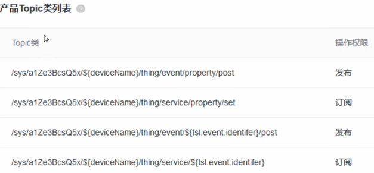

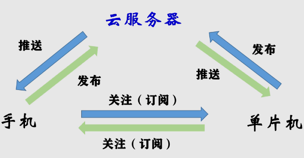

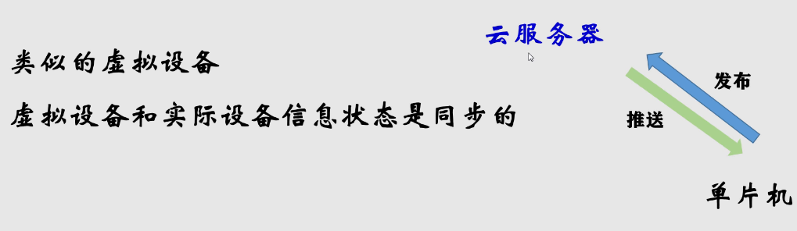

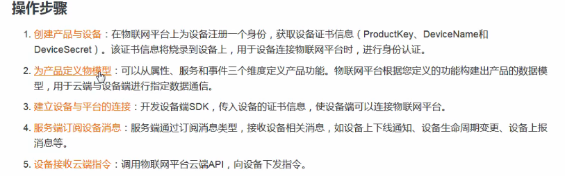

1. 添加产品

   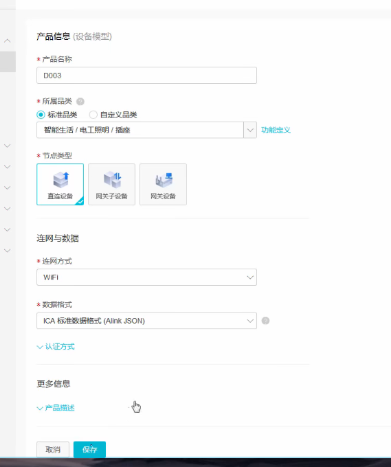

   2. 定义产品特性

      

   3. 添加设备

      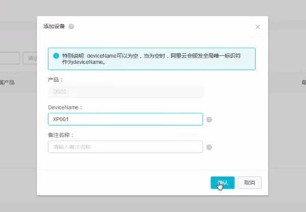

      服务器生成：

      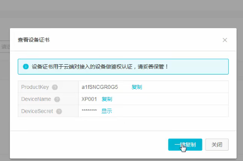

      

# 设备访问接口

## light

1. 访问接口

   ```
   http://192.168.1.xxx:8511/device/light/getLightSwitchState/{deviceName}
   ```

2. 设置接口

   ```
   http://192.168.1.xxx:8511/device/light/getLightSwitchState/{deviceName}?switchState=
   ```

   

## alarm

1. 访问接口

   ```
   http://192.168.1.xxx:8511/device/alarm/getAlarmSwitchState/{deviceName}
   ```

2. 设置接口

   ```
   http://192.168.1.xxx:8511/device/alarm/getAlarmSwitchState/{deviceName}?switchState=
   ```

   

## relay

1. 访问接口

   ```
   http://192.168.1.xxx:8511/device/relay/getRelaySwitchState/{deviceName}
   ```

2. 设置接口

   ```
   http://192.168.1.xxx:8511/device/relay/getRelaySwitchState/{deviceName}?switchState=
   ```

   

## sensor

1. 访问接口

   ```
   http://192.168.1.xxx:8511/device/sensor/updateSensorData/{deviceName}?sensorData=
   ```

## camera


# 数据获取端

## 主控芯片选型

Esp32、Esp cam

Esp cam - 采集摄像头数据 ，直接与服务器通讯

## 传感器模块

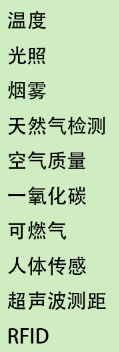

## 执行装置

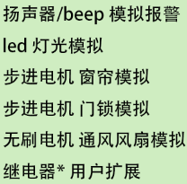

## 接入阿里物联网平台

通过连接wifi，接入阿里物联网平台

实现数据的上传、接收

# 阿里物联网平台

1、降低本地服务器负担


# 服务器端

1、接收App请求，接入阿里云发生指令/接收数据

2、直接调用局域网摄像头，进行人脸识别，要能进行实时处理，能及时处理警报，通知用户

3、接收请求

4、连接数据库

# 客户端

1、要能访问摄像头，已经在服务器端被人脸识别处理过的

2、控制设备

3、获取设备状态


# 网络摄像头

单片机发送图片到服务器时，服务器接收请求，将图片加载到内存，

目前方案：单片机将图片发送到服务器，服务器将图片加载进内存，有客户端访问时，直接将图片返回

用户前端点击：识别到物体移动，自动保存录像，直到不移动后的一分钟

对于后端：


1. esp32连接上wifi
2. 通过向服务器不断发送视频流，服务器端保存

保证可扩展性

## 门口摄像头

服务器内访问摄像头，运行python代码：有几个要求

1. 一检测有变化，开启录像，无变化后的60秒后，停止录像
2. 人脸检测：一检测到人脸将抓拍的图通过邮箱/公众号发送给用户
3. 人脸识别：认识的人脸就将名字和抓拍图通过邮箱/公众号发送给用户；不认识的人脸就通过短信警报通知
   * 警报通知触发条件：连续5次检测到的人脸都不认识

通过web管理页面同样可以访问到摄像头，可以通过手柄控制摄像头方向

采用Esp cam作为门口摄像头，配置3个步进电机，实现3轴无极旋转

### 实现方式

限制：Esp cam只能通过ip访问，一次只能有一个访客

实现前提：能同时在多设备上访问这个摄像头

如何解决？

1. 首先有台服务器实时的获取视频流，保存到本地
2. 多用户访问服务器，服务器读取本地数据返回

## 其他摄像头

无需具备人脸识别功能

直接通过Esp cam进行扩展

通过web管理页面同样可以访问到摄像头，可以通过手柄控制摄像头方向

采用Esp cam作为门口摄像头，配置3个步进电机，实现3轴无极旋转


## 客户端 - espCam 代码

不停给服务器发送图像

```c
#include <WiFi.h>
#include <HTTPClient.h>
#include <ArduinoJson.h>
#include "esp_camera.h"
#include <string.h>
#include <stdlib.h>
#include "freertos/FreeRTOS.h"
#include "freertos/task.h"
#include "esp_log.h"
#include "esp_system.h"
#include "nvs_flash.h"
#include "esp_event.h"
// #include "esp_netif.h"
#include "esp_tls.h"
// #include "esp_crt_bundle.h"

#include "esp_http_client.h"
//　下面四条要自行更改
const char *ssid = "AVENGERS";                      //　wifi名
const char *password = "ASSEMBLE";              //　wifi密码
const char *UpdateVideoStreamUrl = "http://192.168.1.227:8511/device/camera/updateCameraVideoStream";
WiFiClient wifi_Client;
HTTPClient http_client;
String req;
String rsp;
int pushButton = 12;
int outputButton = 13;
// 烧录程序的时候这两个口不要通电，就是说先传代码，再接线，不然大概率传不进去

int state = 0;

//Wifi连接
void setupWifi()
{
  WiFi.begin(ssid, password);

  while (WiFi.status() != WL_CONNECTED) {
    delay(500);
    Serial.print(".");
  }
  Serial.print(WiFi.localIP());
}
 
/* void setUpHttpClient()
{
  req = (String)host + query_addr;
  Serial.println(req);
  if (http_client.begin(req))
  {
    Serial.println("HTTPclient setUp done!");
  }
} */
/* 
#define PART_BOUNDARY "123456789000000000000987654321"
static const char* _STREAM_CONTENT_TYPE = "multipart/x-mixed-replace;boundary=" PART_BOUNDARY;
static const char* _STREAM_BOUNDARY = "\r\n--" PART_BOUNDARY "\r\n";
static const char* _STREAM_PART = "Content-Type: image/jpeg\r\nContent-Length: %u\r\n\r\n";
void postData(){

} */

// 拍照发送并解析响应
void send_data() {
  //拍照，获取图像
  camera_fb_t * fb = esp_camera_fb_get();
 //char* res = "--" PART_BOUNDARY "\r\nContent-Disposition: form-data; name=\"image\"; filename=\"image.png\"\r\nContent-Type: image/png\r\n\r\n";
  // 添加http头
  http_client.addHeader("Content-Type","image/png");
  // 发送请求
  Serial.println("发送照片");

      
    //strcpy(res, (char*)fb->buf);
    //strcpy(res, "\r\n--" PART_BOUNDARY "--\r\n");
    //Serial.print(res);
    int http_code = http_client.POST((uint8_t*)fb->buf, fb->len);

  Serial.println("完成");
  // 解析响应
  if(http_code == 200) {
    rsp = http_client.getString();
    Serial.print(rsp);
/*     DynamicJsonDocument doc(1024);
    // json序列化
    deserializeJson(doc, rsp);
    JsonObject obj = doc.as<JsonObject>();
    // 获取响应数据，我的后端是python，django服务：return JsonResponse({'code': 200, 'data': '1'})
    if(obj["data"]=="1") {
      digitalWrite(outputButton, HIGH);
      Serial.println("验证成功，解锁");
      delay(2000);
      // 每次解锁2秒钟，因为我外接的机械解锁装置是电磁铁，吸合时间过长会烧毁
      digitalWrite(outputButton, LOW);
      } */
  }
  //清空数据，释放内存，我也不知道这行代码到底有没有用
  esp_camera_fb_return(fb);
  }

void setup()
{
  Serial.begin(115200); // 指定波特率
  delay(3000);
  // 指定信号输入口和输出口
  pinMode(outputButton,OUTPUT);
  pinMode(pushButton,INPUT);
  
  setupWifi();
  Serial.print("WIFI OK");
  // setUpHttpClient();

  camera_config_t config1;
  //config1.ledc_channel = 4;
  config1.pin_d0 = 5;
  config1.pin_d1 = 18;
  config1.pin_d2 = 19;
  config1.pin_d3 = 21;
  config1.pin_d4 = 36;
  config1.pin_d5 = 39;
  config1.pin_d6 = 34;
  config1.pin_d7 = 35;
  config1.pin_xclk = 0;
  config1.pin_pclk = 22;
  config1.pin_vsync = 25;
  config1.pin_href = 23;
  config1.pin_sscb_sda = 26;
  config1.pin_sscb_scl = 27;
  config1.pin_pwdn = 32;
  config1.pin_reset = 15;
  config1.xclk_freq_hz = 20000000;
  config1.pixel_format = PIXFORMAT_JPEG;
  // if PSRAM IC present, init with UXGA resolution and higher JPEG quality
  //                      for larger pre-allocated frame buffer.
  if(psramFound()){
    config1.frame_size = FRAMESIZE_UXGA;
    config1.jpeg_quality = 10;
    config1.fb_count = 2;
  } else {
    config1.frame_size = FRAMESIZE_SVGA;
    config1.jpeg_quality = 12;
    config1.fb_count = 1;
  }


  // camera init
  esp_err_t err = esp_camera_init(&config1);//摄像头初始化
  if (err != ESP_OK) {//摄像头初始化失败，则打印消息并终止程序
    Serial.printf("Camera init failed with error 0x%x", err);
    return;
  }
  Serial.printf("camera is runing\n");
  // 摄像头配置 资料来源：https://github.com/espressif/esp32-camera/blob/master/driver/include/sensor.h
  sensor_t *s = esp_camera_sensor_get();//获取调整图像接口
  s->set_framesize(s, FRAMESIZE_VGA);//更改帧尺寸
  /*  set_framesize(s, )可选参数为：
    FRAMESIZE_96x96,    // 96x96
    FRAMESIZE_QQVGA,    // 160x120
    FRAMESIZE_QQVGA2,   // 128x160
    FRAMESIZE_QCIF,     // 176x144
    FRAMESIZE_HQVGA,    // 240x176
    FRAMESIZE_240x240,  // 240x240
    FRAMESIZE_QVGA,     // 320x240
    FRAMESIZE_CIF,      // 400x296
    FRAMESIZE_VGA,      // 640x480
    FRAMESIZE_SVGA,     // 800x600
    FRAMESIZE_XGA,      // 1024x768
    FRAMESIZE_SXGA,     // 1280x1024
    FRAMESIZE_UXGA,     // 1600x1200
    FRAMESIZE_QXGA,     // 2048*1536
    FRAMESIZE_INVALID
  */
  s->set_contrast(s, 2); // 对比度（-2，2），开高了效果好
  s->set_quality(s, 5); // 图像质量（0，63），数字越小质量越高，
  // 不要把质量设得太高，我实测每张照片超过60K就损坏了，官方示例最高只能到10
  s->set_ae_level(s, 1); // 曝光补偿（-2，2）
//  s->set_brightness(s, val); // 感光度（-2，2），可以减小光圈的大小，增加景深，但会增加噪点
//  s->set_saturation(s, val); // 饱和度（-2，2），默认的就挺好
//  s->set_hmirror(s, val); // 水平翻转
//  s->set_vflip(s, val); // 垂直翻转
//  s->set_awb_gain(s, val); // 自动白平衡，默认开启
//  s->set_whitebal(s, val); // 白平衡
//  s->set_aec_value(s, val); // 自动光圈，默认开启
//  s->set_aec2(s, val); // 包围曝光模式，轮流使用多种光圈进行曝光（欠曝，正常，过曝），自动光圈开启时，该选项无效
//  s->set_exposure_ctrl(s, val); 光圈大小（0，1200），自动光圈开启时，该选项无效
//  s->set_dcw(s, val); // 应该属于矫正
//  s->set_bpc(s, val); // 应该属于矫正
//  s->set_wpc(s, val); // 应该属于矫正
//  s->set_raw_gma(s, val); // 伽马矫正
//  s->set_lenc(s, val); // 镜头边缘矫正
//  s->set_special_effect(s, val); // 特殊效果？
//  s->set_agc_gain(s, val); // 增益（0，30），对暗环境有效，开着好？
//  s->set_gain_ctrl(s, val); // 增益开关？
//  s->set_gainceiling(s, (gainceiling_t)val); // 增益？
//  s->set_colorbar(s, val); // 色彩条，用来校准色彩

}
 
void http_send_img(){
    camera_fb_t* fb = NULL;
    esp_http_client_config_t config = {
      url : UpdateVideoStreamUrl
    };
    config.method = HTTP_METHOD_POST;
    config.timeout_ms = 500;
    while (true)
    {
      fb = esp_camera_fb_get();
      if (!fb){
        Serial.println("Camera capture failed");
      } else {
        char *post = (char *)malloc(1024+fb->len);
        memset(post,0,1024+fb->len);
        esp_http_client_handle_t client = esp_http_client_init(&config);
        esp_http_client_set_header(client, "Content-Type", "multipart/form-data; boundary=----WebKitFormBoundary7MA4YWxkTrZu0gW");
        memcpy(post,"------WebKitFormBoundary7MA4YWxkTrZu0gW\r\nContent-Disposition: form-data; name=\"file\"; filename=\"img.jpeg\"\r\nContent-Type: image/jpeg\r\n\r\n",135);
        memcpy(post+135,fb->buf,fb->len);
        memcpy(post+135+fb->len,"\r\n------WebKitFormBoundary7MA4YWxkTrZu0gW--\r\n",45);
        esp_http_client_set_post_field(client, post, 180+fb->len);
        esp_err_t err = esp_http_client_perform(client); 
        if (err == ESP_OK) {
          ESP_LOGI(TAG, "HTTP POST Status = %d, content_length = %d",
              esp_http_client_get_status_code(client),
              esp_http_client_get_content_length(client)
              );
        } else {
            ESP_LOGE(TAG, "HTTP POST request failed: %s", esp_err_to_name(err));
        }
        esp_http_client_cleanup(client);
        esp_camera_fb_return(fb);
        fb = NULL;
        free(post);
      }
    }
}
void loop() {
  // 不断获取信号输入口电平
//   int buttonState = digitalRead(pushButton);
//   if(buttonState == 1) {
    // send_data();
    // }
  http_send_img();
  // delay(10);
}
```

## 可改分辨率

```c
#include <WiFi.h>
#include <HTTPClient.h>
#include <ArduinoJson.h>
#include "esp_camera.h"
#include <string.h>
#include <stdlib.h>
#include "freertos/FreeRTOS.h"
#include "freertos/task.h"
#include "esp_log.h"
#include "esp_system.h"
#include "nvs_flash.h"
#include "esp_event.h"
// #include "esp_netif.h"
#include "esp_tls.h"
// #include "esp_crt_bundle.h"

#include "esp_http_client.h"
//　下面四条要自行更改
const char *ssid = "AVENGERS";                      //　wifi名
const char *password = "ASSEMBLE";              //　wifi密码
const char *UpdateVideoStreamUrl = "http://192.168.1.10:8511/device/camera/espCam/2863624987774568b5e98e0f915f9bd8/uploadVideoStream";
WiFiClient wifi_Client;
HTTPClient http_client;
String req;
String rsp;
int pushButton = 12;
int outputButton = 13;
// 烧录程序的时候这两个口不要通电，就是说先传代码，再接线，不然大概率传不进去
sensor_t *s;//获取调整图像接口
int state = 0;

//Wifi连接
void setupWifi()
{
  WiFi.begin(ssid, password);

  while (WiFi.status() != WL_CONNECTED) {
    delay(500);
    Serial.print(".");
  }
  Serial.print(WiFi.localIP());
}
 
/* void setUpHttpClient()
{
  req = (String)host + query_addr;
  Serial.println(req);
  if (http_client.begin(req))
  {
    Serial.println("HTTPclient setUp done!");
  }
} */
/* 
#define PART_BOUNDARY "123456789000000000000987654321"
static const char* _STREAM_CONTENT_TYPE = "multipart/x-mixed-replace;boundary=" PART_BOUNDARY;
static const char* _STREAM_BOUNDARY = "\r\n--" PART_BOUNDARY "\r\n";
static const char* _STREAM_PART = "Content-Type: image/jpeg\r\nContent-Length: %u\r\n\r\n";
void postData(){

} */

// 拍照发送并解析响应
void send_data() {
  //拍照，获取图像
  camera_fb_t * fb = esp_camera_fb_get();
 //char* res = "--" PART_BOUNDARY "\r\nContent-Disposition: form-data; name=\"image\"; filename=\"image.png\"\r\nContent-Type: image/png\r\n\r\n";
  // 添加http头
  http_client.addHeader("Content-Type","image/png");
  // 发送请求
  Serial.println("发送照片");

      
    //strcpy(res, (char*)fb->buf);
    //strcpy(res, "\r\n--" PART_BOUNDARY "--\r\n");
    //Serial.print(res);
    int http_code = http_client.POST((uint8_t*)fb->buf, fb->len);

  Serial.println("完成");
  // 解析响应
  if(http_code == 200) {
    rsp = http_client.getString();
    Serial.print(rsp);
/*     DynamicJsonDocument doc(1024);
    // json序列化
    deserializeJson(doc, rsp);
    JsonObject obj = doc.as<JsonObject>();
    // 获取响应数据，我的后端是python，django服务：return JsonResponse({'code': 200, 'data': '1'})
    if(obj["data"]=="1") {
      digitalWrite(outputButton, HIGH);
      Serial.println("验证成功，解锁");
      delay(2000);
      // 每次解锁2秒钟，因为我外接的机械解锁装置是电磁铁，吸合时间过长会烧毁
      digitalWrite(outputButton, LOW);
      } */
  }
  //清空数据，释放内存，我也不知道这行代码到底有没有用
  esp_camera_fb_return(fb);
  }

void setup()
{
  Serial.begin(115200); // 指定波特率
  delay(3000);
  // 指定信号输入口和输出口
  pinMode(outputButton,OUTPUT);
  pinMode(pushButton,INPUT);
  
  setupWifi();
  Serial.print("WIFI OK");
  // setUpHttpClient();

  camera_config_t config1;
  //config1.ledc_channel = 4;
  config1.pin_d0 = 5;
  config1.pin_d1 = 18;
  config1.pin_d2 = 19;
  config1.pin_d3 = 21;
  config1.pin_d4 = 36;
  config1.pin_d5 = 39;
  config1.pin_d6 = 34;
  config1.pin_d7 = 35;
  config1.pin_xclk = 0;
  config1.pin_pclk = 22;
  config1.pin_vsync = 25;
  config1.pin_href = 23;
  config1.pin_sscb_sda = 26;
  config1.pin_sscb_scl = 27;
  config1.pin_pwdn = 32;
  config1.pin_reset = 15;
  config1.xclk_freq_hz = 20000000;
  config1.pixel_format = PIXFORMAT_JPEG;
  // if PSRAM IC present, init with UXGA resolution and higher JPEG quality
  //                      for larger pre-allocated frame buffer.
  if(psramFound()){
    config1.frame_size = FRAMESIZE_UXGA;
    config1.jpeg_quality = 10;
    config1.fb_count = 2;
  } else {
    config1.frame_size = FRAMESIZE_SVGA;
    config1.jpeg_quality = 12;
    config1.fb_count = 1;
  }


  // camera init
  esp_err_t err = esp_camera_init(&config1);//摄像头初始化
  if (err != ESP_OK) {//摄像头初始化失败，则打印消息并终止程序
    Serial.printf("Camera init failed with error 0x%x", err);
    return;
  }
  Serial.printf("camera is runing\n");
  // 摄像头配置 资料来源：https://github.com/espressif/esp32-camera/blob/master/driver/include/sensor.h
  s = esp_camera_sensor_get();
  s->set_framesize(s, FRAMESIZE_VGA);//更改帧尺寸
  /*  set_framesize(s, )可选参数为：
    FRAMESIZE_96x96,    // 96x96
    FRAMESIZE_QQVGA,    // 160x120
    FRAMESIZE_QQVGA2,   // 128x160
    FRAMESIZE_QCIF,     // 176x144
    FRAMESIZE_HQVGA,    // 240x176
    FRAMESIZE_240x240,  // 240x240
    FRAMESIZE_QVGA,     // 320x240
    FRAMESIZE_CIF,      // 400x296
    FRAMESIZE_VGA,      // 640x480
    FRAMESIZE_SVGA,     // 800x600
    FRAMESIZE_XGA,      // 1024x768
    FRAMESIZE_SXGA,     // 1280x1024
    FRAMESIZE_UXGA,     // 1600x1200
    FRAMESIZE_QXGA,     // 2048*1536
    FRAMESIZE_INVALID
  */
  s->set_contrast(s, 2); // 对比度（-2，2），开高了效果好
  s->set_quality(s, 5); // 图像质量（0，63），数字越小质量越高，
  // 不要把质量设得太高，我实测每张照片超过60K就损坏了，官方示例最高只能到10
  s->set_ae_level(s, 1); // 曝光补偿（-2，2）
//  s->set_brightness(s, val); // 感光度（-2，2），可以减小光圈的大小，增加景深，但会增加噪点
//  s->set_saturation(s, val); // 饱和度（-2，2），默认的就挺好
//  s->set_hmirror(s, val); // 水平翻转
//  s->set_vflip(s, val); // 垂直翻转
//  s->set_awb_gain(s, val); // 自动白平衡，默认开启
//  s->set_whitebal(s, val); // 白平衡
//  s->set_aec_value(s, val); // 自动光圈，默认开启
//  s->set_aec2(s, val); // 包围曝光模式，轮流使用多种光圈进行曝光（欠曝，正常，过曝），自动光圈开启时，该选项无效
//  s->set_exposure_ctrl(s, val); 光圈大小（0，1200），自动光圈开启时，该选项无效
//  s->set_dcw(s, val); // 应该属于矫正
//  s->set_bpc(s, val); // 应该属于矫正
//  s->set_wpc(s, val); // 应该属于矫正
//  s->set_raw_gma(s, val); // 伽马矫正
//  s->set_lenc(s, val); // 镜头边缘矫正
//  s->set_special_effect(s, val); // 特殊效果？
//  s->set_agc_gain(s, val); // 增益（0，30），对暗环境有效，开着好？
//  s->set_gain_ctrl(s, val); // 增益开关？
//  s->set_gainceiling(s, (gainceiling_t)val); // 增益？
//  s->set_colorbar(s, val); // 色彩条，用来校准色彩

}
uint8_t preSizeState = 8;
void http_send_img(){
    camera_fb_t* fb = NULL;
    esp_http_client_config_t config = {
      url : UpdateVideoStreamUrl
    };
    config.method = HTTP_METHOD_POST;
    config.timeout_ms = 500;
    while (true)
    {
      fb = esp_camera_fb_get();
      if (!fb){
        Serial.println("Camera capture failed");
      } else {
        char *post = (char *)malloc(1024+fb->len);
        memset(post,0,1024+fb->len);
        esp_http_client_handle_t client = esp_http_client_init(&config);
        esp_http_client_set_header(client, "Content-Type", "multipart/form-data; boundary=----WebKitFormBoundary7MA4YWxkTrZu0gW");
        memcpy(post,"------WebKitFormBoundary7MA4YWxkTrZu0gW\r\nContent-Disposition: form-data; name=\"file\"; filename=\"img.jpeg\"\r\nContent-Type: image/jpeg\r\n\r\n",135);
        memcpy(post+135,fb->buf,fb->len);
        memcpy(post+135+fb->len,"\r\n------WebKitFormBoundary7MA4YWxkTrZu0gW--\r\n",45);
        esp_http_client_set_post_field(client, post, 180+fb->len);
        esp_err_t err = esp_http_client_perform(client); 
        if (err == ESP_OK) {
          ESP_LOGI(TAG, "HTTP POST Status = %d, content_length = %d",
              esp_http_client_get_status_code(client),
              esp_http_client_get_content_length(client),
              );
          int len =  esp_http_client_get_content_length(client);
          char buf[3] = {0,0,0};
          esp_http_client_read(client, buf, len);
          uint8_t currSizeState = atoi(buf);
          if(preSizeState != currSizeState){
            s->set_framesize(s, (framesize_t)currSizeState);//更改帧尺寸
            preSizeState = currSizeState;
          }
        } else {
            ESP_LOGE(TAG, "HTTP POST request failed: %s", esp_err_to_name(err));
        }
        esp_http_client_cleanup(client);
        esp_camera_fb_return(fb);
        fb = NULL;
        free(post);
      }
    }
}
void loop() {
  // 不断获取信号输入口电平
//   int buttonState = digitalRead(pushButton);
//   if(buttonState == 1) {
    // send_data();
    // }
  http_send_img();
  // delay(10);
}
```


## 服务器端代码

```java
static private ByteArrayOutputStream staticByteArrayOutputStream;   
/* 摄像头 */
    @RequestMapping("/camera/updateCameraVideoStream")
    @ResponseBody
    public String img(HttpServletRequest request,
                      @RequestParam("file") MultipartFile multipartFile
    ) throws IOException {
        if (multipartFile != null){
            String filename = multipartFile.getOriginalFilename();
//            System.out.println("fileName: " + filename);
            InputStream inputStream = multipartFile.getInputStream();
            ByteArrayOutputStream tempBaos = new ByteArrayOutputStream();
            byte[] bytes = new byte[1024];
            int len;
            while ((len=inputStream.read(bytes)) != -1){
                tempBaos.write(bytes, 0, len);
            }
            tempBaos.flush();
            staticByteArrayOutputStream = tempBaos;
//            System.out.println(staticByteArrayOutputStream.hashCode());

        }else {
            System.out.println("no image received! ");
        }
        return "responseOk!";
    }

    @RequestMapping("/camera/videoStream")
    public void videoStream(HttpServletResponse response) throws IOException, InterruptedException {
        String boundary = "----WebKitFormBoundary7MA4YWxkTrZu0gW";
        response.setContentType("multipart/x-mixed-replace; boundary="+boundary);
        ServletOutputStream outputStream = response.getOutputStream();

        // 不断地读取第一个元素，读完第一个元素后，再次读，如果读到的和上一个元素地址一样，暂停
        ByteArrayOutputStream preEle = staticByteArrayOutputStream;
        ByteArrayOutputStream currEle = null;
        while (true){
            currEle = staticByteArrayOutputStream;
            Thread.sleep(1);
//            System.out.println("preEle"+preEle+"; currEle:"+currEle+";"+(preEle==currEle));
            if (preEle.hashCode() != currEle.hashCode()){
                // 方法二：使用outputStream
                System.out.println("Thread: "+Thread.currentThread().getName()+"; currEle="+currEle.hashCode());
                outputStream.write(("--"+boundary+"\r\nContent-Type: image/jpeg\r\n\r\n").getBytes("utf-8"));
                currEle.writeTo(outputStream);
                outputStream.write("\r\n".getBytes("utf-8"));
                preEle = currEle;
            }
        }
    }
```


# 关于外设的按钮

硬件连接

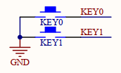

程序：

INPUT_PULLUP

中断：FALLING

```c
/* 外部中断 */ 
ICACHE_RAM_ATTR void highInterrupt(){
  ETS_GPIO_INTR_DISABLE();//关闭中断
  delay_ms(10);
  int val = digitalRead(KEY_PIN);
  if (val == 0){
。。。
  }
  ETS_GPIO_INTR_ENABLE();//打开中断
}
```


# 灯光控制

描述一个设备？

1. 类型
2. 名称
3. 简述
4. 状态
5. 状态详情
6. 

需求：

1. 方便添加删除设备
2. 无需更改服务器端代码

传输方式：

设备、网页端 ——》 服务器 ——》数据库

1. 首先在网页端上申请一个设备，向服务器发起一个请求
2. 数据库将用户填写的deviceName添加进数据库
3. 用户将deviceName烧入单片机
4. 编写单片机端代码，向服务器端发起get请求，获取数据

## 引脚定义

gpio2 - rgb灯

gpio0 - 按键输入

按键输入 - gnd

按键功能：当按下按键时，使电灯的状态发生翻转

进入中断函数：

1. 使灯翻转
2. 并且向服务器发起请求，置位灯的状态

## esp01s 测试代码 - 外部中断

```c
#include <Adafruit_NeoPixel.h>
#include <Arduino.h>
#include <ESP8266WiFi.h>
#include <ESP8266WiFiMulti.h>
#include <ESP8266HTTPClient.h>
#include <WiFiClient.h>
#include <ArduinoJson.h>
#define LED_PIN 2
#define KEY_PIN 0

uint8_t led = LOW;
void setup() {
  Serial.begin(115200);
 // put your setup code here, to run once:

  // 设置LED管脚为输出模式

  pinMode(LED_PIN,OUTPUT);

  // 设置外置按钮管脚为上拉输入模式

  pinMode(KEY_PIN,INPUT_PULLUP);

  // 设置外置按钮管脚中断为上升沿触发模式

  attachInterrupt(KEY_PIN, highInterrupt, RISING);

}
ICACHE_RAM_ATTR void highInterrupt(){
  Serial.print("highInterrupt\r\n");
}
ICACHE_RAM_ATTR void lowInterrupt(){
  Serial.print("lowInterrupt\r\n");
}
void loop() {
  Serial.print("loop\r\n");
  digitalWrite(LED_PIN, HIGH);
  delay(500);
  digitalWrite(LED_PIN, LOW);
  delay(500);
}
```


## esp01s 测试代码 - 发起请求，接收参数

```c
#include <Adafruit_NeoPixel.h>
#include <Arduino.h>
#include <ESP8266WiFi.h>
#include <ESP8266WiFiMulti.h>
#include <ESP8266HTTPClient.h>
#include <WiFiClient.h>
#include <ArduinoJson.h>
#define ssid "AVENGERS"
#define password "ASSEMBLE"
#define url "http://192.168.1.234:8511/device/light/getLightSwitchState/testLight01"
ESP8266WiFiMulti WiFiMulti;
DynamicJsonDocument doc(1024);
#define PIN 2
// 连接WS2812的数量
#define NUMPIXELS 1
// 初始化
Adafruit_NeoPixel pixels = Adafruit_NeoPixel(NUMPIXELS, PIN, NEO_GRB + NEO_KHZ800);
int delayval = 500;
void setup() {
  // This initializes the NeoPixel library.
  Serial.begin(115200);
  // Serial.setDebugOutput(true);
  for (uint8_t t = 4; t > 0; t--) {
    Serial.printf("[SETUP] WAIT %d...\n", t);
    Serial.flush();
    delay(1000);
  }
  WiFi.mode(WIFI_STA);
  WiFiMulti.addAP(ssid, password);
  pixels.begin();
  pixels.setPixelColor(0, pixels.Color(204,204,255));
  pixels.clear();
  pixels.show();
}

void loop() {
  // wait for WiFi connection
  if ((WiFiMulti.run() == WL_CONNECTED)) {
    WiFiClient client;
    HTTPClient http;
    Serial.print("[HTTP] begin...\n");
    // configure traged server and url
    http.begin(client, url);
    Serial.print("[HTTP] GET...\n");
    // start connection and send HTTP header
    int httpCode = http.GET();
    if (httpCode > 0) {
      // HTTP header has been send and Server response header has been handled
      Serial.printf("[HTTP] GET... code: %d\n", httpCode);
      // file found at server
      if (httpCode == HTTP_CODE_OK) {
        String payload = http.getString();
        Serial.println(payload);
        DeserializationError error = deserializeJson(doc, payload);
        if (error)
          return;
        boolean flag = doc["flag"];
        if (flag){
          // 收到的数据无误
          boolean switchState = doc["data"]["switchState"];
          // 设置灯的开关
          if (switchState){
            // 灯开
            Serial.println("light on\r\n");
            pixels.setPixelColor(0, pixels.Color(204,204,255));
            // 发送数据，WS2812发光
            pixels.show();
          } else {
            // 灯关  
            Serial.println("light off\r\n");
            pixels.clear();
            pixels.show();
          } 
        } else {
          // 打印错误
          String errorMsg = doc["errorMsg"];
          Serial.print("error: ");
          Serial.print(errorMsg);
          Serial.print("\r\n");
        }
      }
    } else {
      Serial.printf("[HTTP] GET... failed, error: %s\n", http.errorToString(httpCode).c_str());
    }
    http.end();
  }
  delay(1000);
}
```

## esp01s light-v0.1 代码

```c
#include <Adafruit_NeoPixel.h>
#include <Arduino.h>
#include <ESP8266WiFi.h>
#include <ESP8266WiFiMulti.h>
#include <ESP8266HTTPClient.h>
#include <WiFiClient.h>
#include <ArduinoJson.h>

#define ssid "AVENGERS"
#define password "ASSEMBLE"
#define url "http://192.168.1.10:8511/device/light/testLight01/dfd1ceff4b0341efbbaedded2fbcd75d/getOrSetDeviceSwitchState?switchState="
#define LED_PIN 2
#define KEY_PIN 0
#define NUMPIXELS 1  // 连接WS2812的数量
Adafruit_NeoPixel pixels = Adafruit_NeoPixel(NUMPIXELS, LED_PIN, NEO_GRB + NEO_KHZ800);
ESP8266WiFiMulti WiFiMulti;
DynamicJsonDocument doc(1024);
int switchState = 0; // 0：关、1：开 、2：null
boolean switchFlag = false; // false: 关、true：开
/* 发生get请求，更改服务器端，虚拟灯珠的状态 */
void chanageVirtualLightSwitchState(boolean flag){
  if ((WiFiMulti.run() == WL_CONNECTED)) {
    WiFiClient client;
    HTTPClient http;
    if (flag)
      http.begin(client, url  "true");
    else
      http.begin(client, url  "flase");
    Serial.print("[HTTP] GET...\n");
    http.GET();
    http.end();
  }  
}

void ICACHE_FLASH_ATTR delay_ms(u32 C_time)
{  for(;C_time>0;C_time--)
  { os_delay_us(1000);}
}
/* 外部中断 */ 
ICACHE_RAM_ATTR void highInterrupt(){
  ETS_GPIO_INTR_DISABLE();//关闭中断
  delay_ms(15);
  int val = digitalRead(KEY_PIN);
  if (val == 0){
    Serial.print("highInterrupt\r\n");
    /* 将灯珠的状态翻转 */
    if (switchFlag == true){
      // 让灯关    
      lightOff();
      switchState = 0;
      Serial.print("let light off\r\n");
    } else {
      // 让灯开
      switchState = 1;
      Serial.print("let light on\r\n");
      lightOn();
    }
  }
  ETS_GPIO_INTR_ENABLE();//打开中断
}
void lightOn(){
  Serial.println("light on\r\n");
  pixels.setPixelColor(0, pixels.Color(204,204,255));
  // 发送数据，WS2812发光
  pixels.show();
  switchFlag = true;
}
void lightOff(){
  Serial.println("light off\r\n");
  pixels.clear();
  pixels.show();
  switchFlag = false;
}

/* 初始化 */
void setup() {
  Serial.begin(115200); // 串口初始化
  /* 外部中断引脚初始化：GPIO0(下拉) */
  pinMode(KEY_PIN,INPUT_PULLUP); // 设置外置按钮管脚为上拉输入模式
  attachInterrupt(digitalPinToInterrupt(KEY_PIN), highInterrupt, FALLING); // 设置外置按钮管脚中断为上升沿触发模式
  /* wifi初始化 */
  WiFi.mode(WIFI_STA);
  WiFiMulti.addAP(ssid, password);
  /* 灯珠初始化 */
  pixels.begin();
  pixels.setPixelColor(0, pixels.Color(204,204,255));
  pixels.clear();
  pixels.show();
}
/* 主循环 */
void loop() {
  // wait for WiFi connection
  if ((WiFiMulti.run() == WL_CONNECTED)) {
    WiFiClient client;
    HTTPClient http;
    Serial.print("[HTTP] begin...\n");
    // configure traged server and url
    if (switchState == 1){
      http.begin(client, url "true");
      switchState = 2;
    }else if (switchState == 0){
      http.begin(client, url "flase");
      switchState = 2;
    }else if (switchState == 2) {
      // null
      http.begin(client, url);
    }      
    Serial.print("[HTTP] GET...\n");
    // start connection and send HTTP header
    int httpCode = http.GET();
    if (httpCode > 0) {
      // HTTP header has been send and Server response header has been handled
      Serial.printf("[HTTP] GET... code: %d\n", httpCode);
      // file found at server
      if (httpCode == HTTP_CODE_OK) {
        String payload = http.getString();
        Serial.println(payload);
        DeserializationError error = deserializeJson(doc, payload);
        if (error)
          return;
        boolean flag = doc["flag"];
        if (flag){
          // 收到的数据无误
          boolean flag = doc["data"]["switchState"];
          // 设置灯的开关
          if (flag){
            // 灯开
            lightOn();
          } else {
            // 灯关  
            lightOff();
          } 
        } else {
          // 打印错误
          String errorMsg = doc["errorMsg"];
          Serial.print("error: ");
          Serial.print(errorMsg);
          Serial.print("\r\n");
        }
      }
    } else {
      Serial.printf("[HTTP] GET... failed, error: %s\n", http.errorToString(httpCode).c_str());
    }
    http.end();
  }
  delay(1000);
  
}
```


# 继电器控制

类似light

```c
#include <Arduino.h>
#include <ESP8266WiFi.h>
#include <ESP8266WiFiMulti.h>
#include <ESP8266HTTPClient.h>
#include <WiFiClient.h>
#include <ArduinoJson.h>

#define ssid "AVENGERS"
#define password "ASSEMBLE"
#define url "http://192.168.1.10:8511/device/relay/testRealy01/972e1ca506be4dc08c130ad4a30d0b90/getOrSetDeviceSwitchState?switchState="
#define RELAY_PIN 2
#define KEY_PIN 0
ESP8266WiFiMulti WiFiMulti;
DynamicJsonDocument doc(1024);
int switchState = 0; // 0：关、1：开 、2：null
boolean switchFlag = false; // false: 关、true：开

void ICACHE_FLASH_ATTR delay_ms(u32 C_time)
{  for(;C_time>0;C_time--)
  { os_delay_us(1000);}
}
/* 外部中断 */ 
ICACHE_RAM_ATTR void highInterrupt(){
  ETS_GPIO_INTR_DISABLE();//关闭中断
  delay_ms(15);
  int val = digitalRead(KEY_PIN);
  if (val == 0){
    Serial.print("highInterrupt\r\n");
    /* 将继电器的状态翻转 */
    if (switchFlag == true){
      // 让继电器关    
      relayOff();
      switchState = 0;
      Serial.print("let light off\r\n");
    } else {
      // 让继电器开
      switchState = 1;
      Serial.print("let light on\r\n");
      relayOn();
    }
  }
  ETS_GPIO_INTR_ENABLE();//打开中断
}
void relayOn(){
  Serial.println("light on\r\n");
  digitalWrite(RELAY_PIN, HIGH);
  switchFlag = true;
}
void relayOff(){
  Serial.println("light off\r\n");
  digitalWrite(RELAY_PIN, LOW);
  switchFlag = false;
}

/* 初始化 */
void setup() {
  Serial.begin(115200); // 串口初始化
  /* 外部中断引脚初始化：GPIO0(下拉) */
  pinMode(KEY_PIN,INPUT_PULLUP); // 设置外置按钮管脚为上拉输入模式
  attachInterrupt(digitalPinToInterrupt(KEY_PIN), highInterrupt, FALLING); // 设置外置按钮管脚中断为上升沿触发模式
  /* wifi初始化 */
  WiFi.mode(WIFI_STA);
  WiFiMulti.addAP(ssid, password);
  /* 继电器初始化 */
  pinMode(RELAY_PIN, OUTPUT);
  digitalWrite(RELAY_PIN, LOW);
}
/* 主循环 */
void loop() {
  // wait for WiFi connection
  if ((WiFiMulti.run() == WL_CONNECTED)) {
    WiFiClient client;
    HTTPClient http;
    Serial.print("[HTTP] begin...\n");
    // configure traged server and url
    if (switchState == 1){
      http.begin(client, url "true");
      switchState = 2;
    }else if (switchState == 0){
      http.begin(client, url "flase");
      switchState = 2;
    }else if (switchState == 2) {
      // null
      http.begin(client, url);
    }      
    Serial.print("[HTTP] GET...\n");
    // start connection and send HTTP header
    int httpCode = http.GET();
    if (httpCode > 0) {
      // HTTP header has been send and Server response header has been handled
      Serial.printf("[HTTP] GET... code: %d\n", httpCode);
      // file found at server
      if (httpCode == HTTP_CODE_OK) {
        String payload = http.getString();
        Serial.println(payload);
        DeserializationError error = deserializeJson(doc, payload);
        if (error)
          return;
        boolean flag = doc["flag"];
        if (flag){
          // 收到的数据无误
          boolean flag = doc["data"]["switchState"];
          // 设置灯的开关
          if (flag){
            // 继电器开
            relayOn();
          } else {
            // 继电器关  
            relayOff();
          } 
        } else {
          // 打印错误
          String errorMsg = doc["errorMsg"];
          Serial.print("error: ");
          Serial.print(errorMsg);
          Serial.print("\r\n");
        }
      }
    } else {
      Serial.printf("[HTTP] GET... failed, error: %s\n", http.errorToString(httpCode).c_str());
    }
    http.end();
  }
  delay(1000);
  
}
```

# 传感器控制

## 温湿度传感 - DHT11

测量范围: 湿度 20~90%RH,温度 0~50℃ 

### esp01s , 驱动代码

```c
#include <Adafruit_NeoPixel.h>
#include <Arduino.h>
#include <ESP8266WiFi.h>
#include <ESP8266WiFiMulti.h>
#include <ESP8266HTTPClient.h>
#include <WiFiClient.h>
#include <ArduinoJson.h>
#define DOUT 2
#define ssid "AVENGERS"
#define password "ASSEMBLE"
#define host "http://192.168.1.10:8511"
#define urlTemp host "/device/sensor/temperatureTest01/bb90f08378e54ee7a0a5f4b6e37c193a/updateSensorData?sensorData="
#define urlHumidity host "/device/sensor/humidityTest01/bb90f08378e54ee7a0a5f4b6e37c193a/updateSensorData?sensorData="

ESP8266WiFiMulti WiFiMulti;
DynamicJsonDocument doc(1024);

//复位 DHT11
void DHT11_Rst(void)
{
    pinMode(DOUT, OUTPUT);
    digitalWrite(DOUT, LOW);
    delay(20);
    digitalWrite(DOUT, HIGH);
    delayMicroseconds(30);
}
//等待 DHT11 的回应
//返回 1:未检测到 DHT11 的存在
//返回 0:存在
uint8_t DHT11_Check(void)
{
    uint8_t retry=0;
    pinMode(DOUT, INPUT);//SET INPUT
    while (digitalRead(DOUT)&&retry<100) //DHT11 会拉低 40~80us
    {
        retry++;
        delayMicroseconds(1);
    };
    if(retry>=100)return 1;
    else retry=0;
    while (!digitalRead(DOUT)&&retry<100)//DHT11 拉低后会再次拉高 40~80us
    {
        retry++;
        delayMicroseconds(1);
    };
    if(retry>=100)return 1;
    return 0;
}
//从 DHT11 读取一个位
//返回值： 1/0
uint8_t DHT11_Read_Bit(void)
{
    uint8_t retry=0;
    while(digitalRead(DOUT)&&retry<100)//等待变为低电平
    {
        retry++;
        delayMicroseconds(1);
    }
    retry=0;
    while(!digitalRead(DOUT)&&retry<100)//等待变高电平
    {
        retry++;
        delayMicroseconds(1);
    }
    delayMicroseconds(40);//等待 40us
    if(digitalRead(DOUT))return 1;
    else return 0;
}
//从 DHT11 读取一个字节
//返回值：读到的数据
uint8_t DHT11_Read_Byte(void)
{
    uint8_t i,dat;
    dat=0;
    for (i=0;i<8;i++)
    {
        dat<<=1;
        dat|=DHT11_Read_Bit();
    }
    return dat;
}
//从 DHT11 读取一次数据
//temp:温度值(范围:0~50° )
//humi:湿度值(范围:20%~90%)
//返回值： 0,正常;1,读取失败
uint8_t DHT11_Read_Data(uint8_t *temp,uint8_t *humi)
{
    uint8_t buf[5];
    uint8_t i;
    DHT11_Rst();
    if(DHT11_Check()==0)
    {
        for(i=0;i<5;i++)//读取 40 位数据
        {
            buf[i]=DHT11_Read_Byte();
        }
        if((buf[0]+buf[1]+buf[2]+buf[3])==buf[4])
        {
            *humi=buf[0];
            *temp=buf[2];
        }
    }else return 1;
    return 0;
}
uint8_t DHT11_Init(){
    Serial.print("DHT11_Init...\r\n");
    pinMode(DOUT, OUTPUT);
    DHT11_Rst(); //复位 DHT11
    return DHT11_Check(); //等待 DHT11 的回应
}

boolean requestGet(String url){
    // wait for WiFi connection
    if ((WiFiMulti.run() != WL_CONNECTED))
      return false;
    WiFiClient client;
    HTTPClient http;
    Serial.print("[HTTP] begin...\n");
    // configure traged server and url
    http.begin(client, url);
    Serial.print(url);
    Serial.print("[HTTP] GET...\n");
    // start connection and send HTTP header
    int httpCode = http.GET();
    if (httpCode > 0) {
      // HTTP header has been send and Server response header has been handled
      Serial.printf("[HTTP] GET... code: %d\n", httpCode);
      // file found at server
      if (httpCode == HTTP_CODE_OK) {
        String payload = http.getString();
        Serial.println(payload);
        DeserializationError error = deserializeJson(doc, payload);
        if (error){
          http.end();
          return false;
        }
        boolean flag = doc["flag"];
        if (flag){
          // 收到的数据无误
          http.end();
          return true;
        } else {
          // 打印错误
          String errorMsg = doc["errorMsg"];
          Serial.print("error: ");
          Serial.print(errorMsg);
          Serial.print("\r\n");
          http.end();
          return false;
        }
      }
    } else {
      Serial.printf("[HTTP] GET... failed, error: %s\n", http.errorToString(httpCode).c_str());
    }
    http.end();
    return false;
}


void setup() {
    // This initializes the NeoPixel library.
    Serial.begin(115200);
    WiFi.mode(WIFI_STA);
    WiFiMulti.addAP(ssid, password);
    while(DHT11_Init());
}

void loop() {
    uint8_t temperature, humidity;
    // put your main code here, to run repeatedly:
    DHT11_Read_Data(&temperature,&humidity); //读取温湿度值
    Serial.print("temperature=");
    Serial.print(temperature);
    Serial.print("; humidity=");
    Serial.print(humidity);
    Serial.print("\r\n");
    if (temperature>100 || humidity>100)
      return;
    requestGet(urlTemp + String(temperature));
    requestGet(urlHumidity + String(humidity));
    delay(3500);
}
```

### esp01s 温湿度传感器DHT11 v0.1 代码

```c
#include <Adafruit_NeoPixel.h>
#include <Arduino.h>
#include <ESP8266WiFi.h>
#include <ESP8266WiFiMulti.h>
#include <ESP8266HTTPClient.h>
#include <WiFiClient.h>
#include <ArduinoJson.h>
#define DOUT 2
#define ssid "AVENGERS"
#define password "ASSEMBLE"
#define host "http://192.168.1.10:8511"
#define urlTemp host "/device/sensor/temperatureTest01/bb90f08378e54ee7a0a5f4b6e37c193a/updateSensorData?sensorData="
#define urlHumidity host "/device/sensor/humidityTest01/bb90f08378e54ee7a0a5f4b6e37c193a/updateSensorData?sensorData="

ESP8266WiFiMulti WiFiMulti;
DynamicJsonDocument doc(1024);

//复位 DHT11
void DHT11_Rst(void)
{
    pinMode(DOUT, OUTPUT);
    digitalWrite(DOUT, LOW);
    delay(20);
    digitalWrite(DOUT, HIGH);
    delayMicroseconds(30);
}
//等待 DHT11 的回应
//返回 1:未检测到 DHT11 的存在
//返回 0:存在
uint8_t DHT11_Check(void)
{
    uint8_t retry=0;
    pinMode(DOUT, INPUT);//SET INPUT
    while (digitalRead(DOUT)&&retry<100) //DHT11 会拉低 40~80us
    {
        retry++;
        delayMicroseconds(1);
    };
    if(retry>=100)return 1;
    else retry=0;
    while (!digitalRead(DOUT)&&retry<100)//DHT11 拉低后会再次拉高 40~80us
    {
        retry++;
        delayMicroseconds(1);
    };
    if(retry>=100)return 1;
    return 0;
}
//从 DHT11 读取一个位
//返回值： 1/0
uint8_t DHT11_Read_Bit(void)
{
    uint8_t retry=0;
    while(digitalRead(DOUT)&&retry<100)//等待变为低电平
    {
        retry++;
        delayMicroseconds(1);
    }
    retry=0;
    while(!digitalRead(DOUT)&&retry<100)//等待变高电平
    {
        retry++;
        delayMicroseconds(1);
    }
    delayMicroseconds(40);//等待 40us
    if(digitalRead(DOUT))return 1;
    else return 0;
}
//从 DHT11 读取一个字节
//返回值：读到的数据
uint8_t DHT11_Read_Byte(void)
{
    uint8_t i,dat;
    dat=0;
    for (i=0;i<8;i++)
    {
        dat<<=1;
        dat|=DHT11_Read_Bit();
    }
    return dat;
}
//从 DHT11 读取一次数据
//temp:温度值(范围:0~50° )
//humi:湿度值(范围:20%~90%)
//返回值： 0,正常;1,读取失败
uint8_t DHT11_Read_Data(uint8_t *temp,uint8_t *humi)
{
    uint8_t buf[5];
    uint8_t i;
    DHT11_Rst();
    if(DHT11_Check()==0)
    {
        for(i=0;i<5;i++)//读取 40 位数据
        {
            buf[i]=DHT11_Read_Byte();
        }
        if((buf[0]+buf[1]+buf[2]+buf[3])==buf[4])
        {
            *humi=buf[0];
            *temp=buf[2];
        }
    }else return 1;
    return 0;
}
uint8_t DHT11_Init(){
    Serial.print("DHT11_Init...\r\n");
    pinMode(DOUT, OUTPUT);
    DHT11_Rst(); //复位 DHT11
    return DHT11_Check(); //等待 DHT11 的回应
}

boolean requestGet(String url){
    // wait for WiFi connection
    if ((WiFiMulti.run() != WL_CONNECTED))
      return false;
    WiFiClient client;
    HTTPClient http;
    Serial.print("[HTTP] begin...\n");
    // configure traged server and url
    http.begin(client, url);
    Serial.print(url);
    Serial.print("[HTTP] GET...\n");
    // start connection and send HTTP header
    int httpCode = http.GET();
    if (httpCode > 0) {
      // HTTP header has been send and Server response header has been handled
      Serial.printf("[HTTP] GET... code: %d\n", httpCode);
      // file found at server
      if (httpCode == HTTP_CODE_OK) {
        String payload = http.getString();
        Serial.println(payload);
        DeserializationError error = deserializeJson(doc, payload);
        if (error){
          http.end();
          return false;
        }
        boolean flag = doc["flag"];
        if (flag){
          // 收到的数据无误
          http.end();
          return true;
        } else {
          // 打印错误
          String errorMsg = doc["errorMsg"];
          Serial.print("error: ");
          Serial.print(errorMsg);
          Serial.print("\r\n");
          http.end();
          return false;
        }
      }
    } else {
      Serial.printf("[HTTP] GET... failed, error: %s\n", http.errorToString(httpCode).c_str());
    }
    http.end();
    return false;
}


void setup() {
    // This initializes the NeoPixel library.
    Serial.begin(115200);
    WiFi.mode(WIFI_STA);
    WiFiMulti.addAP(ssid, password);
    while(DHT11_Init());
}

void loop() {
    uint8_t temperature, humidity;
    // put your main code here, to run repeatedly:
    DHT11_Read_Data(&temperature,&humidity); //读取温湿度值
    Serial.print("temperature=");
    Serial.print(temperature);
    Serial.print("; humidity=");
    Serial.print(humidity);
    Serial.print("\r\n");
    if (temperature>100 || humidity>100)
      return;
    requestGet(urlTemp + String(temperature));
    requestGet(urlHumidity + String(humidity));
    delay(3500);
}
```


## 温度传感 - DS18B20

测量温度范围为-55~+125℃

# 人体红外传感器HC-SR501

在学习STM32系列的芯片时，算是第一次和开发板打交道，所以很多时候不知道如何查看引脚和相关功能，虽然只是借助外设进行一些实验，但开始的时候还是感到很困难。
而且学习的过程中越来越感受到知识的积累是一个十分漫长的过程，可能只是一些很简单的知识点，可是如果不加以归纳总结，自己日后还是会忘记，所以希望自己每学一点内容都可以记录下来，可能刚开始都只能是转载和整合其他人的内容，但在不断的积累中，也自然会有自己的改变，希望这些点点滴滴可以让我的知识大厦越来越高。

除代码部分
转载自：http://www.arduino.cn/thread-2851-1-1.html
（若有侵权，请联系博主删除本文，谢谢！）

### **工作原理**

人体都有恒定的体温，一般在37度，所以会发出特定波长10UM左右的红外线，被动式红外探头就是靠探测人体发射的10UM左右的红外线而进行工作的。人体发射的10UM左右的红外线通过菲泥尔滤光片增强后聚集到红外感应源上。
红外感应源通常采用热释电元件，这种元件在接收到**人体红外辐射温度发生变化**时就会失去电荷平衡，向外释放电荷，后续电路经检测处理后就能产生报警信号。

### **热释电效应：**

当一些晶体受热时，在晶体两端将会产生数量相等而符号相反的电荷。这种由于热变化而产生的电极化现象称为热释电效应。

### **菲涅耳透镜：**

根据菲涅耳原理制成，菲涅耳透镜分为折射式和反射式两种形式，其作用一是聚焦作用，将热释的红外信号折射（反射）在PIR上；二是将检测区内分为若干个明区和暗区，使进入检测区的移动物体能以温度变化的形式在PIR上产生变化热释红外信号，这样PIR就能产生变化电信号。使热释电人体红外传感器(PIR)灵敏度大大增加。


### **模块参数：**

1. 工作电压：DC5V至20V
2. 静态功耗：65微安
3. 电平输出：高3.3V，低0V
4. 延时时间：可调(0.3秒~18秒)
5. 封锁时间：0.2秒
6. 触发方式：L不可重复，H可重复，默认值为H(跳帽选择)
7. 感应范围：小于120度锥角，7米以内
8. 工作温度：-15~+70度

### **模块特性：**

1、这种探头是以探测人体辐射为目标的。所以热释电元件对波长为10UM左右的红外辐射必须非常敏感。
2、为了仅仅对人体的红外辐射敏感，在它的辐射照面通常覆盖有特殊的菲泥尔滤光片，使环境的干扰受到明显的控制作用。
3、被动红外探头，其传感器包含两个互相串联或并联的热释电元。而且制成的两个电极化方向正好相反，环境背景辐射对两个热释元件几乎具有相同的作用，使其产生释电效应相互抵消，于是探测器无信号输出。
4、一旦人侵入探测区域内，人体红外辐射通过部分镜面聚焦，并被热释电元接收，但是两片热释电元接收到的热量不同，热释电也不同，不能抵消，经信号处理而报警。
5、菲泥尔滤光片根据性能要求不同，具有不同的焦距(感应距离)，从而产生不同的监控视场，视场越多，控制越严密。

### **触发方式：**

**L不可重复，H可重复。可跳线选择，默认为H。**
A. 不可重复触发方式：即感应输出高电平后，延时时间一结束，输出将自动从高电平变为低电平。
B. 重复触发方式： 即感应输出高电平后，在延时时间段内，如果有人体在其感应范围内活动，其输出将一直保持高电平，直到人离开后才延时将高电平变为低电平(感应模块检测到人体的每一次活动后会自动顺延一个延时时间段，并且以最后一次活动的时间为延时时间的起始点)。

### **可调封锁时间及检测距离调节：**

1、 调节检测距离
2、 封锁时间：感应模块在每一次感应输出后(高电平变为低电平)，可以紧跟着设置一个封锁时间，在此时间段内感应器不接收任何感应信号。此功能可以实现(感应输出时间和封锁时间)两者的间隔工作，可应用于间隔探测产品；同时此功能可有效抑制负载切换过程中产生的各种干扰。(默认封锁时间2.5S)

**注：**
**1、调节距离电位器顺时针旋转，感应距离增大（约 7 米），反之，感应距离减小（约 3 米）。**
**2、调节延时电位器顺时针旋转，感应延时加长（约300S），反之，感应延时减短（约 0.5S）。**


### **光敏控制：**

模块预留有位置，可设置光敏控制，白天或光线强时不感应。光敏控制为可选功能,出厂时未安装光敏电阻。


### **模块优缺点：**

**优点：**
本身不发任何类型的辐射，器件功耗很小，隐蔽性好。价格低廉。

**缺点：**
容易受各种热源、光源干扰
被动红外穿透力差，人体的红外辐射容易被遮挡，不易被探头接收。
易受射频辐射的干扰。
环境温度和人体温度接近时，探测和灵敏度明显下降，有时造成短时失灵。

### **模块抗干扰：**

1、 防小动物干扰
2、 防电磁干扰
3、 防强灯光干扰

### **安装：**

红外线热释电人体传感器只能安装在室内，其误报率与安装的位置和方式有极大的关系，正确的安装应满足下列条件：
\1. 红外线热释电传感器应离地面2.0-2.2米。
\2. 红外线热释电传感器远离空调, 冰箱，火炉等空气温度变化敏感的地方。
\3. 红外线热释电传感器探测范围内不得隔屏、家具、大型盆景或其他隔离物。
\4. 红外线热释电传感器不要直对窗口，否则窗外的热气流扰动和人员走动会引起误报，有条件的最好把窗帘拉上。红外线热释电传感器也不要安装在有强气流活动的地方。
红外线热释电传感器对人体的敏感程度还和人的运动方向关系很大。热释电红外传感器对于径向移动反应最不敏感, 而对于横切方向 (即与半径垂直的方向)移动则最为敏感. 在现场选择合适的安装位置是避免红外探头误报、求得最佳检测灵敏度极为重要的一环。

### **STMF103RCT6 实例代码**

```c
#include <Adafruit_NeoPixel.h>
#include <Arduino.h>
#include <ESP8266WiFi.h>
#include <ESP8266WiFiMulti.h>
#include <ESP8266HTTPClient.h>
#include <WiFiClient.h>
#include <ArduinoJson.h>
#define BODYSENSOR_PIN 0
#define ssid "AVENGERS"
#define password "ASSEMBLE"
#define host "http://192.168.1.10:8511"
#define urlBodySensor host "/device/sensor/bodySensor/bc843d2ceda64bdd99a1f55b6c706aa7/updateSensorData?sensorData="
uint8_t currentBodySensorData;
uint8_t preBodySensorData;
ESP8266WiFiMulti WiFiMulti;
DynamicJsonDocument doc(1024);

boolean requestGet(String url){
    // wait for WiFi connection
    if ((WiFiMulti.run() != WL_CONNECTED))
      return false;
    WiFiClient client;
    HTTPClient http;
    Serial.print("[HTTP] begin...\n");
    // configure traged server and url
    http.begin(client, url);
    Serial.print(url);
    Serial.print("[HTTP] GET...\n");
    // start connection and send HTTP header
    int httpCode = http.GET();
    if (httpCode > 0) {
      // HTTP header has been send and Server response header has been handled
      Serial.printf("[HTTP] GET... code: %d\n", httpCode);
      // file found at server
      if (httpCode == HTTP_CODE_OK) {
        String payload = http.getString();
        Serial.println(payload);
        DeserializationError error = deserializeJson(doc, payload);
        if (error){
          http.end();
          return false;
        }
        boolean flag = doc["flag"];
        if (flag){
          // 收到的数据无误
          http.end();
          return true;
        } else {
          // 打印错误
          String errorMsg = doc["errorMsg"];
          Serial.print("error: ");
          Serial.print(errorMsg);
          Serial.print("\r\n");
          http.end();
          return false;
        }
      }
    } else {
      Serial.printf("[HTTP] GET... failed, error: %s\n", http.errorToString(httpCode).c_str());
    }
    http.end();
    return false;
}


void setup() {
    // This initializes the NeoPixel library.
    Serial.begin(115200);
    WiFi.mode(WIFI_STA);
    WiFiMulti.addAP(ssid, password);
    pinMode(BODYSENSOR_PIN, INPUT);
    preBodySensorData = digitalRead(BODYSENSOR_PIN);
}

void loop() {
    // 判断当前状态，如果为1，再次判断是否和上一个状态是否一样，一样则不发送请求
    // 判断当前状态，如果为0，直接发送请求
    currentBodySensorData = digitalRead(BODYSENSOR_PIN);
    if (currentBodySensorData == 1){
      if (currentBodySensorData != preBodySensorData){
            requestGet(urlBodySensor + String(currentBodySensorData));      
        }
    }else{
        requestGet(urlBodySensor + String(currentBodySensorData));      
    }
    preBodySensorData = digitalRead(BODYSENSOR_PIN);
    Serial.printf("bodySensorData=%d; \r\n", currentBodySensorData);
    // requestGet(urlBodySensor + String(humidity));
    delay(1000);
}
```


# 报警器控制

类似继电器

```c
#include <Arduino.h>
#include <ESP8266WiFi.h>
#include <ESP8266WiFiMulti.h>
#include <ESP8266HTTPClient.h>
#include <WiFiClient.h>
#include <ArduinoJson.h>

#define ssid "AVENGERS"
#define password "ASSEMBLE"
#define url "http://192.168.1.10:8511/device/alarm/alarmTest01/092901dc3e3449b2ab34075534d83b2a/getOrSetDeviceSwitchState?switchState="
#define PWM 2
#define KEY_PIN 0
ESP8266WiFiMulti WiFiMulti;
DynamicJsonDocument doc(1024);
int switchState = 0; // 0：关、1：开 、2：null
boolean switchFlag = false; // false: 关、true：开
boolean  beepFreqFlag = false;
void ICACHE_FLASH_ATTR delay_ms(u32 C_time)
{  for(;C_time>0;C_time--)
  { os_delay_us(1000);}
}
/* 外部中断 */ 
ICACHE_RAM_ATTR void highInterrupt(){
  ETS_GPIO_INTR_DISABLE();//关闭中断
  delay_ms(20);
  int val = digitalRead(KEY_PIN);
  if (val == 0){
    Serial.print("highInterrupt\r\n");
    /* 将蜂鸣器的状态翻转 */
    if (switchFlag == true){
      // 让蜂鸣器关    
      alarmOff();
      switchState = 0;
      Serial.print("let light off\r\n");
    } else {
      // 让蜂鸣器开
      switchState = 1;
      Serial.print("let light on\r\n");
      alarmOn();
    }
  }
  ETS_GPIO_INTR_ENABLE();//打开中断
}
void alarmOn(){
  Serial.println("light on\r\n");
  analogWrite(PWM, 220);
  switchFlag = true;
}
void alarmOff(){
  Serial.println("light off\r\n");
  analogWrite(PWM, 0);
  switchFlag = false;
}

/* 初始化 */
void setup() {
  Serial.begin(115200); // 串口初始化
  /* 外部中断引脚初始化：GPIO0(下拉) */
  pinMode(KEY_PIN,INPUT_PULLUP); // 设置外置按钮管脚为上拉输入模式
  attachInterrupt(digitalPinToInterrupt(KEY_PIN), highInterrupt, FALLING); // 设置外置按钮管脚中断为上升沿触发模式
  /* wifi初始化 */
  WiFi.mode(WIFI_STA);
  WiFiMulti.addAP(ssid, password);
  /* 蜂鸣器初始化 */
  analogWriteFreq(4000);
}
/* 主循环 */
void loop() {
  // wait for WiFi connection
  if (switchFlag){
    // 如果蜂鸣器响了，每秒更改蜂鸣器频率
      if (beepFreqFlag){
        analogWriteFreq(4000);
        beepFreqFlag = false;
      } else {
        analogWriteFreq(3000);
        beepFreqFlag = true;  
      }
  }
  if ((WiFiMulti.run() == WL_CONNECTED)) {
    WiFiClient client;
    HTTPClient http;
    Serial.print("[HTTP] begin...\n");
    // configure traged server and url
    if (switchState == 1){
      http.begin(client, url "true");
      switchState = 2;
    }else if (switchState == 0){
      http.begin(client, url "flase");
      switchState = 2;
    }else if (switchState == 2) {
      // null
      http.begin(client, url);
    }      
    Serial.print("[HTTP] GET...\n");
    // start connection and send HTTP header
    int httpCode = http.GET();
    if (httpCode > 0) {
      // HTTP header has been send and Server response header has been handled
      Serial.printf("[HTTP] GET... code: %d\n", httpCode);
      // file found at server
      if (httpCode == HTTP_CODE_OK) {
        String payload = http.getString();
        Serial.println(payload);
        DeserializationError error = deserializeJson(doc, payload);
        if (error)
          return;
        boolean flag = doc["flag"];
        if (flag){
          // 收到的数据无误
          boolean flag = doc["data"]["switchState"];
          // 设置灯的开关
          if (flag){
            // 蜂鸣器开
            alarmOn();
          } else {
            // 蜂鸣器关  
            alarmOff();
          } 
        } else {
          // 打印错误
          String errorMsg = doc["errorMsg"];
          Serial.print("error: ");
          Serial.print(errorMsg);
          Serial.print("\r\n");
        }
      }
    } else {
      Serial.printf("[HTTP] GET... failed, error: %s\n", http.errorToString(httpCode).c_str());
    }
    http.end();
  }
  delay(1000);
}
```

# 一体式烟雾有毒气体报警模块

硬件连接：

MQ5 - 32

MQ2 - 33

motor - 16

switch - 18

beep - 2

## espDev kit v0.1 代码

```c
#include <Arduino.h>

#include <WiFi.h>
#include <WiFiMulti.h>
#include <HTTPClient.h>
// #include <ESP8266WiFi.h>
// #include <ESP8266WiFiMulti.h>
// #include <ESP8266HTTPClient.h>
#include <WiFiClient.h>
#include <ArduinoJson.h>
#define MQ5PIN 32 // 可燃气
#define MQ2PIN 33 // 烟雾
#define ALART 2 // 报警
#define MOTOR 16 // 电机
#define KEY_PIN 18 // 按键
#define ssid "AVENGERS"
#define password "ASSEMBLE"
#define host "http://192.168.1.10:8511"
#define urlMQ2 host "/device/sensor/mq2Test/bb90f08378e54ee7a0a5f4b6e37c193a/updateSensorData?sensorData="
#define urlMQ5 host "/device/sensor/mq5Test/01b95f5404cd4de29b966101a6064f24/updateSensorData?sensorData="
#define urlAlart host "/device/alarm/alarmTest02/ba103ceb1bd848848e1744653fc0b8dd/getOrSetDeviceSwitchState?switchState="
int switchState = 0; // 0：关、1：开 、2：null
boolean switchFlag = false; // false: 关、true：开
boolean  beepFreqFlag = false;
WiFiMulti wifiMulti;
DynamicJsonDocument doc(1024);
void alarmOn(){
  Serial.println("light on\r\n");
  ledcWrite(ALART, 220);
  // ledcWrite(MOTOR, 800);
  digitalWrite(MOTOR, HIGH); // 电机
  switchFlag = true;
}
void alarmOff(){
  Serial.println("light off\r\n");
  ledcWrite(ALART, 0);
  // ledcWrite(MOTOR, 0);
  digitalWrite(MOTOR, LOW); // 电机
  switchFlag = false;
}

void ICACHE_FLASH_ATTR delay_ms(int C_time)
{  for(;C_time>0;C_time--)
  { ets_delay_us(1000);}
}

/* 外部中断 */ 
ICACHE_RAM_ATTR void highInterrupt(){
  detachInterrupt(KEY_PIN);
  int val = digitalRead(KEY_PIN);
  // if (val == 0){
    delay_ms(15);
    // val = digitalRead(KEY_PIN);
    if (val == 0)
    {
      Serial.print("highInterrupt\r\n");
      /* 将蜂鸣器的状态翻转 */
      if (switchFlag == true){
        // 让蜂鸣器关    
        alarmOff();
        switchState = 0;
        Serial.print("let light off\r\n");
      } else {
        // 让蜂鸣器开
        switchState = 1;
        Serial.print("let light on\r\n");
        alarmOn();
      } 
    // }
    
  }
  attachInterrupt(digitalPinToInterrupt(KEY_PIN), highInterrupt, FALLING);
  // ETS_GPIO_INTR_ENABLE();//打开中断
}

/**
 * @brief 给服务器发reques请求，可以设置设备状态，并返回
 * 
 * @param url 
 * @param deviceType // 1：传感器、2：报警器
 * @return boolean 
 */
boolean requestGet(String url, int deviceType){
    // wait for WiFi connection
    if ((wifiMulti.run() != WL_CONNECTED))
      return false;
    WiFiClient client;
    HTTPClient http;
    Serial.print("[HTTP] begin...\n");
    // configure traged server and url
  
    http.begin(client, url);
    Serial.print(url);
    Serial.print("[HTTP] GET...\n");
    // start connection and send HTTP header
    int httpCode = http.GET();
    if (httpCode > 0) {
      // HTTP header has been send and Server response header has been handled
      Serial.printf("[HTTP] GET... code: %d\n", httpCode);
      // file found at server
      if (httpCode == HTTP_CODE_OK) {
        String payload = http.getString();
        Serial.println(payload);
        DeserializationError error = deserializeJson(doc, payload);
        if (error){
          http.end();
          return false;
        }
        boolean flag = doc["flag"];
        if (flag){
          // 收到的数据无误
          http.end();
          boolean flag2 = doc["data"]["switchState"];
          // 设置开关
          if (flag2 && deviceType==2){
            // 开
            alarmOn();
          } else if(flag2==false && deviceType==2) {
            // 关  
            alarmOff();
          } 
          return true;
        } else {
          // 打印错误
          String errorMsg = doc["errorMsg"];
          Serial.print("error: ");
          Serial.print(errorMsg);
          Serial.print("\r\n");
          http.end();
          return false;
        }
      }
    } else {
      Serial.printf("[HTTP] GET... failed, error: %s\n", http.errorToString(httpCode).c_str());
    }
    http.end();
    return false;
}

void setup() {
  // put your setup code here, to run once:
  Serial.begin(115200);
  /* 外部中断引脚初始化：GPIO0(下拉) */
  pinMode(KEY_PIN,INPUT_PULLUP); // 设置外置按钮管脚为上拉输入模式
  attachInterrupt(digitalPinToInterrupt(KEY_PIN), highInterrupt, FALLING); // 设置外置按钮管脚中断为上升沿触发模式
  /* wifi 初始化 */
  WiFi.mode(WIFI_STA);
  wifiMulti.addAP(ssid, password);
  /* 传感器初始化 */
  analogSetWidth(12);
  /* 蜂鸣器初始化 */
  pinMode(ALART,OUTPUT);
  ledcSetup(2,4000,10);
  ledcAttachPin(ALART,2);
  /* motor初始化 */
  pinMode(MOTOR, OUTPUT);
  // ledcSetup(4,4000,10);
  // ledcAttachPin(MOTOR,4);

  
}
void loop() {
  // put your main code here, to run repeatedly:
  String urlAlartTemp;
  /* 读取传感器 */
  int mq5 = analogRead(MQ5PIN);
  int mq2 = analogRead(MQ2PIN);
  Serial.print("mq5: ");
  Serial.print(mq5 / 40.96);
  Serial.print("%; mq2: ");
  Serial.print(mq2 / 40.96);
  Serial.print("%\r\n");
  requestGet(urlMQ2 + String(mq2 / 40.96), 1);
  requestGet(urlMQ5 + String(mq5 / 40.96), 1);
  /* 蜂鸣器 */
  if (switchFlag){
  // 如果蜂鸣器响了，每秒更改蜂鸣器频率
    if (beepFreqFlag){
      ledcWriteTone(2,4000);
      beepFreqFlag = false;
    } else {
      ledcWriteTone(2,3500);
      beepFreqFlag = true;  
    }
  }
    if (switchState == 1){
      urlAlartTemp = String(urlAlart) + String("true");
      // http.begin(client, url + String("true"));
      switchState = 2;
    }else if (switchState == 0){
      urlAlartTemp = String(urlAlart) + String("false");
      // http.begin(client, url + String("flase"));
      switchState = 2;
    }else if (switchState == 2) {
      // null
      // http.begin(client, url);
      urlAlartTemp = String(urlAlart);
    }  
  requestGet(urlAlartTemp, 2);
  // ledcWrite(ALART, 220);

  delay(1000);
}

```


# RGB灯多模式

```c
#include <Adafruit_NeoPixel.h>
#include <Arduino.h>
#include <ESP8266WiFi.h>
#include <ESP8266WiFiMulti.h>
#include <ESP8266HTTPClient.h>
#include <WiFiClient.h>
#include <ArduinoJson.h>
#include "Ticker.h"

#define ssid "AVENGERS"
#define password "ASSEMBLE"
#define url "http://192.168.1.10:8511/device/light/lightRGB/14e4c5cd489e4d7c93fac1d532a9e4d8/getOrSetDeviceMultiSwitchState?switchState="
#define LED_PIN 2
#define KEY_PIN 0
#define NUMPIXELS 1  // 连接WS2812的数量

Ticker myTicker; //建立一个需要定时调度的对象
Adafruit_NeoPixel pixels = Adafruit_NeoPixel(NUMPIXELS, LED_PIN, NEO_GRB + NEO_KHZ800);
ESP8266WiFiMulti WiFiMulti;
DynamicJsonDocument doc(1024);
bool isReadyToChangeSwitchState = false;
int modeIndex = 0;
// 0: 关闭
// 1: 常亮（白光）
// 2: 常亮（暖光）
// 3: 彩灯

void ICACHE_FLASH_ATTR delay_ms(u32 C_time)
{  for(;C_time>0;C_time--)
  { os_delay_us(1000);}
}
void setMode(int modeIndex){
  if (modeIndex == 0){
      lightMode0(); // 关
  }else if (modeIndex == 1){
      lightMode1(); // 白灯
  }else if (modeIndex == 2){
      lightMode2(); // 黄灯
  }else if (modeIndex == 3){
      lightMode3();
  }
}

/* 外部中断 */ 
ICACHE_RAM_ATTR void highInterrupt(){
  ETS_GPIO_INTR_DISABLE();//关闭中断
  delay_ms(15);
  int val = digitalRead(KEY_PIN);
  if (val == 0){
    // 循环切换灯珠状态
    isReadyToChangeSwitchState = true;
    modeIndex += 1;
    if (modeIndex > 3)
      modeIndex = 0;
  }
  ETS_GPIO_INTR_ENABLE();//打开中断
}
// 关
void lightMode0(){
  Serial.println("lightMode0 \r\n");
  pixels.clear();
  pixels.show();

}
// 白灯
void lightMode1(){
  Serial.println("lightMode1 \r\n");
  pixels.setPixelColor(0, pixels.Color(255,255,255));
  pixels.show();

}
// 关
void lightMode2(){
  Serial.println("lightMode2 \r\n");
  pixels.setPixelColor(0, pixels.Color(255,100,0));
  pixels.show();

}
// rgb切换
// 255,0,0 -> 255,0,255 -> 0,0,255 -> 0,255,255 -> 0,255,0 -> 255,255,0 -> 255,0,0
void lightMode3(){
  int i = 0;
  while(true){
    
    Serial.println("lightMode3 \r\n");
    
  Serial.println("1");
  for (i=0; i<=255; i++){
    pixels.setPixelColor(0, pixels.Color(255, 0, i));  
    pixels.show();
    delay(10);
    if(modeIndex != 3)
      return;
  }
  
  Serial.println("2");
  for (i=255; i>0; i--){
    pixels.setPixelColor(0, pixels.Color(i, 0, 255));  
    pixels.show();
    delay(10);
    if(modeIndex != 3)
      return;
  }
  Serial.println("3");
  for (i=0; i<=255; i++){
    pixels.setPixelColor(0, pixels.Color(0, i, 255));  
    pixels.show();
    delay(10);
    if(modeIndex != 3)
      return;
  }
  Serial.println("4");
  for (i=255; i>0; i--){
    pixels.setPixelColor(0, pixels.Color(0, 255, i));  
    pixels.show();
    delay(10);
    if(modeIndex != 3)
      return;
  }
  Serial.println("5");
  for (i=0; i<=255; i++){
    pixels.setPixelColor(0, pixels.Color(i, 255, 0));  
    pixels.show();
    delay(10);
    if(modeIndex != 3)
      return;
  }
  Serial.println("6");
  for (i=255; i>0; i--){
    pixels.setPixelColor(0, pixels.Color(255, i, 0));  
    pixels.show();
    delay(10);
    if(modeIndex != 3)
      return;
  }
    keepConnected();
  }
  
}

void keepConnected(){
  if ((WiFiMulti.run() == WL_CONNECTED)) {
    WiFiClient client;
    HTTPClient http;
    Serial.print("[HTTP] begin...\n");
    // configure traged server and url
    if(isReadyToChangeSwitchState){
      http.begin(client, String(url) + String(modeIndex)); 
      isReadyToChangeSwitchState = false;  
    }else{
      http.begin(client, String(url));    
    }
    Serial.print("[HTTP] GET...\n");
    // start connection and send HTTP header
    int httpCode = http.GET();
    if (httpCode > 0) {
      // HTTP header has been send and Server response header has been handled
      Serial.printf("[HTTP] GET... code: %d\n", httpCode);
      // file found at server
      if (httpCode == HTTP_CODE_OK) {
        String payload = http.getString();
        Serial.println(payload);
        DeserializationError error = deserializeJson(doc, payload);
        if (error)
          return;
        boolean flag = doc["flag"];
        if (flag){
          // 收到的数据无误
          int multiSwitchState = doc["data"]["multiSwitchState"];
          // 设置灯的开关
          if (multiSwitchState >=0 && multiSwitchState <=3)
          Serial.printf("multiSwitchState=%d \r\n", multiSwitchState);
            modeIndex = multiSwitchState;
            setMode(modeIndex);
        } else {
          // 打印错误
          String errorMsg = doc["errorMsg"];
          Serial.print("error: ");
          Serial.print(errorMsg);
          Serial.print("\r\n");
        }
      }
    } else {
      Serial.printf("[HTTP] GET... failed, error: %s\n", http.errorToString(httpCode).c_str());
    }
    http.end();
  }
  }

/* 初始化 */
void setup() {
  Serial.begin(115200); // 串口初始化
  /* 外部中断引脚初始化：GPIO0(下拉) */
  pinMode(KEY_PIN,INPUT_PULLUP); // 设置外置按钮管脚为上拉输入模式
  attachInterrupt(digitalPinToInterrupt(KEY_PIN), highInterrupt, FALLING); // 设置外置按钮管脚中断为上升沿触发模式
  /* wifi初始化 */
  WiFi.mode(WIFI_STA);
  WiFiMulti.addAP(ssid, password);
  /* 灯珠初始化 */
  pixels.begin();
  pixels.setPixelColor(0, pixels.Color(204,204,255));
  pixels.clear();
  pixels.show();
  // 和服务器获取连接，并传输数据
  // myTicker.attach(5, keepConnected);
}
/* 主循环 */
void loop() {
  setMode(modeIndex);
  keepConnected();
  delay(1000);
}
```


# 网页端

实现功能：

1. 添加房间
2. 添加设备，用户实现单片机端代码
3. 增删改查
   1. 增设备
   2. 删设备
   3. 修改设备deviceName，改设备房间，切换设备状态
   4. 查看设备状态

## 自定义模式逻辑：

* 如：当某传感器感应到，之后某些设备动作

### 所需表：

1. sensor 表

   ```sql
   CREATE TABLE `sensor` (
     `id` int(10) unsigned NOT NULL AUTO_INCREMENT COMMENT '主键',
     `deviceName` varchar(30) NOT NULL COMMENT '设备标识',
     `remarks` varchar(50) DEFAULT NULL COMMENT '备注',
     `state` tinyint(1) NOT NULL COMMENT '在线状态（1在线、0不在线）',
     `roomId` int(11) NOT NULL COMMENT '房间id（外键）',
     `unit` varchar(10) DEFAULT NULL COMMENT '单位',
     `deviceTypeId` int(11) DEFAULT '4' COMMENT '设备类型id（外键）',
     PRIMARY KEY (`id`)
   ) ENGINE=InnoDB AUTO_INCREMENT=5 DEFAULT CHARSET=utf8
   ```

   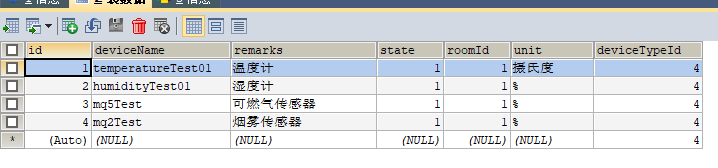

2. deviceType表

   ```sql
   CREATE TABLE `devicetype` (
     `id` int(10) unsigned NOT NULL AUTO_INCREMENT COMMENT '主键',
     `typeName` varchar(20) DEFAULT NULL COMMENT '类型名',
     `describe` varchar(30) DEFAULT NULL COMMENT '描述',
     PRIMARY KEY (`id`)
   ) ENGINE=InnoDB AUTO_INCREMENT=6 DEFAULT CHARSET=utf8
   
   ```

   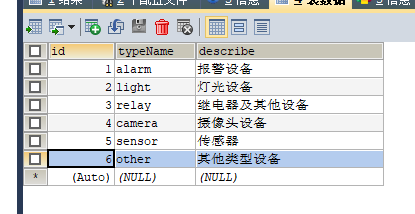

3. event 表

   ```sql
   CREATE TABLE `event` (
     `id` int(10) unsigned NOT NULL AUTO_INCREMENT COMMENT '模式主键',
     `modeName` varchar(20) NOT NULL COMMENT '模式名',
     `describe` varchar(50) DEFAULT NULL COMMENT '描述',
     `sensorId` int(11) DEFAULT NULL COMMENT '传感器id',
     `triggerThreshold` double(10,2) DEFAULT NULL COMMENT '触发阈值，当超过这个值，执行事件',
     PRIMARY KEY (`id`)
   ) ENGINE=InnoDB AUTO_INCREMENT=3 DEFAULT CHARSET=utf8
   ```

   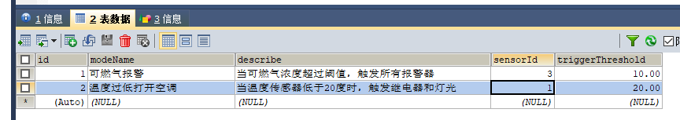

   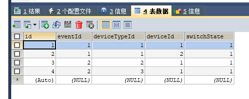

4. eventTriggerStep

   ```sql
   CREATE TABLE `eventtriggerstep` (
     `id` int(10) unsigned NOT NULL AUTO_INCREMENT COMMENT '主键',
     `eventId` int(11) DEFAULT NULL COMMENT '时间id',
     `deviceTypeId` int(11) DEFAULT NULL COMMENT '设备类型',
     `deviceId` int(11) DEFAULT NULL COMMENT '设备id',
     PRIMARY KEY (`id`)
   ) ENGINE=InnoDB DEFAULT CHARSET=utf8
   
   ```

   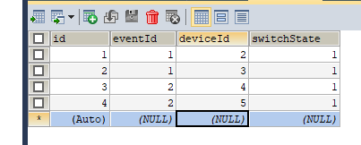

5. device表

   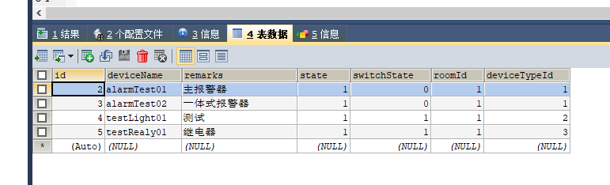

### 实现步骤

1. 用户发起请求，创建一个模式逻辑

   ```json
   {
       modeName: // 模式名
       describe: // 描述
   	sensorId: // 传感器id
       triggerThreshold: // 触发阈值，必须大于或等于这个值
       triggerDevices: [
       	{
       		deciceId: // 设备id
       		switchState: // 打开还是关：true or false
   		},
       	{
       		deciceId: // 设备id
       		switchState: // 打开还是关：true or false
   		}
   		...
       ]
   }
   ```

2. 存入数据库

3. 传感器上报数据时，在service层，查数据库，并判断有无超过阈值

   * 通过 id或deviceName查找even表是否存在该sensorId，可能返回多条数据（一个sensor可以存在多个逻辑），通过 java bean 对象接收，返回一个数组
   * 遍历每一个数组，判断当前上报的数据，有无超过阈值，有则跳出循环，得到当前的 eventId

4. 如果超过，则在eventtriggerstep 表找eventId，通过 java bean 对象接收，返回一个数组

   ```sql
   # 设 当前传感器：可燃气报警器（id=3）, 上报的数值: 5
   
   -- 获取到的，准备要设置的switchState的设备及switchState
   SELECT 
   	-- eventtriggerstep.`deviceId`
   	eventtriggerstep.`deviceId`, eventtriggerstep.`switchState`
   FROM 
   	eventtriggerstep, device
   WHERE 
   	eventtriggerstep.eventId=(
   		SELECT event.id FROM EVENT WHERE event.sensorId=3 AND event.triggerThreshold>=5	
   	)
   	AND eventtriggerstep.`deviceId` = device.`id`
   ```

   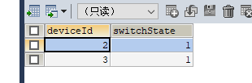

5. 遍历它，设置device状态


## 设备管理


### 添加设备

```json
// 执行类
{
    deviceTypeName: // 1报警、2灯光、3继电器、4传感器、5摄像头
    deviceName: // 设备名，唯一的，需要烧入硬件端
    remarks: // 设备标识，命名设备
    isMultiSwitch: // 多种设备状态：true/false；如果false，默认为只有两张状态的设备
    multiSwitchState: [
    	{switchState:, describe:} // 状态（0）、描述
    	{switchState:, describe:} // 状态(1)、描述
    	{switchState:, describe:} // 状态(2)、描述
    ]
    roomId: // 可以为空
}

// 传感器类
{
    deviceTypeName: // 1报警、2灯光、3继电器、4传感器、5摄像头
    deviceName: // 设备名，唯一的，需要烧入硬件端
    remarks: // 设备标识，命名设备
    roomId: // 可以为空
    unit: // 单位，如：摄氏度
}
```

如1：

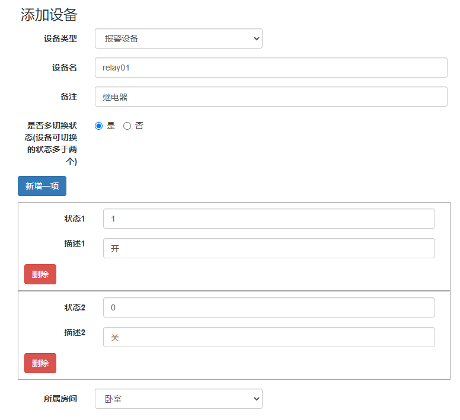

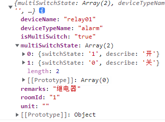

如2：

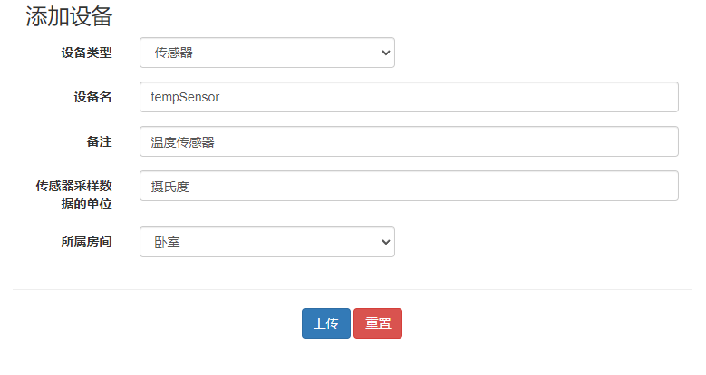

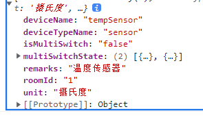


# 数据库结果更新

统一融入device表

## 执行设备接口：

http://localhost:8511/device/{设备类型}/{设备名}/{设备密钥}/getOrSetDeviceSwitchState

http://localhost:8511/device/{设备类型}/{设备名}/{设备密钥}/getOrSetDeviceSwitchState?switchState=

* 参数：true 、false

如：

```
http://192.168.1.10:8511/device/relay/testRealy01/972e1ca506be4dc08c130ad4a30d0b90/getOrSetDeviceSwitchState?switchState=

```

## 传感器接口：

http://localhost:8511/device/sensor/{设备名}/设备密钥/updateSensorData?sensorData=

如：

```
http://192.168.1.10:8511/device/sensor/sensor6666/01b95f5404cd4de29b966101a6064f24/updateSensorData?sensorData=666
```

## 多状态设备接口：

http://localhost:8511/device/{设备类型}/{设备名}/{设备密钥}/getOrSetDeviceMultiSwitchState?switchState=

如：

```
http://localhost:8511/device/light/light159/14e4c5cd489e4d7c93fac1d532a9e4d8/getOrSetDeviceMultiSwitchState?switchState=
```


# 分页条件查询


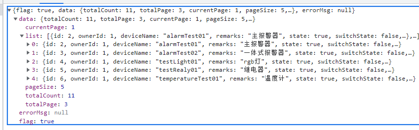

## 代码

### domain

```java
@Data
public class Device {
    private int id;
    private int ownerId;
    private String deviceName;
    private String remarks;
    private Boolean state;
    private Boolean switchState;
    private String unit;
    private int roomId;
    private String roomName;
    private int deviceTypeId;
    private String deviceTypeName;
    private int isMultiSwitch;
    private String deviceSecret;
    private int currentMultiSwitchState;
    private List<MultiSwitchState> multiSwitchStates;
    private String pic;
    private SensorData latestSensorData;
    private List<SensorData> sensorDataList;
}
```

```java
@Data
public class MultiSwitchState {
    private int switchState;
    private String describe;
}

```

```java
@Data
public class PageBean<T> {
    private int totalCount; // 总记录数
    private int totalPage; // 总页数
    private int currentPage; // 当前页码
    private int pageSize; // 每页显示条数
    private List<T> list; // 每页显示的数据集合
}
```

```java
@Data
public class ResultInfo {
    private boolean flag;//后端返回结果正常为true，发生异常返回false
    private Object data;//后端返回结果数据对象
    private String errorMsg;//发生异常的错误消息
}
```

```java
@Data
public class SensorData {
    private Date samplingTime;
    private double samplingData;
}

```

### controller

```java
    /* 分页条件查询 */
    @GetMapping(value = "/getDeviceByPage/{page}/{rows}/{roomName}/{typeName}/{keyword}", produces = "application/json;charset=UTF-8")
    @ResponseBody()
    public String getDeviceByPage(@PathVariable("page") int page,
                                  @PathVariable("rows") int rows,
                                  @PathVariable("typeName") String typeName,
                                  @PathVariable("roomName") String roomName,
                                  @PathVariable("keyword") String keyword) throws IOException {
        User user = new User();
        user.setId(1);
        ResultInfo resultInfo = new ResultInfo();
//        ---------------
        /* 封装参数 */
        if ("全部".equals(typeName)){
            // 设备类型
            typeName = null;
        }
        if ("全部".equals(roomName)){
            // 房间类型
            roomName = null;
        }
        if ("null".equals(keyword)){
            keyword = null;
        }
        Map<String, Object> map = new HashMap<>();
        map.put("page", page); // 第几页
        map.put("index", (page-1) * rows); // 开始索引 (page-1) * row
        map.put("rows", rows); // 数量
        map.put("typeName", typeName);
        map.put("roomName", roomName);
        map.put("keyword", keyword);
        map.put("ownerId", user.getId());
        PageBean<Device> devices = deviceService.getDeviceByPage(map);
        resultInfo.setFlag(true);
        resultInfo.setData(devices);
        return toJsonString(resultInfo);
    }

```

### service

```java
    @Override
    public PageBean<Device> getDeviceByPage(Map<String, Object> map) {
        PageBean<Device> devicePageBean = new PageBean<>();
        // 查询所有设备数量包括传感器
        // 分页、条件查找 所有的设备
        List<Device> devices = deviceMapper.getDeviceByPageAndKeyword(map);
        for (Device device : devices) {
            // 判断是否是多状态设备
            int isMultiSwitch = device.getIsMultiSwitch();
            if (isMultiSwitch == 1){
                // 是
                // 查询multiStateSwitch表，完成赋值
                List<MultiSwitchState> multiSwitchStates = deviceMapper.getMultiSwitchStates(device.getId());
                device.setMultiSwitchStates(multiSwitchStates);
            }
            // 判断是否是传感器设备
            if ("sensor".equals(device.getDeviceTypeName())){
                // 设置当前传感器的数据
                SensorData sensorData = deviceMapper.getLatestSensorData(device.getId());
                device.setLatestSensorData(sensorData);
            }
//            System.out.println(device);
        }
        devicePageBean.setList(devices);
        // 条件查找 所有的设备数量
        int count = deviceMapper.getDeviceTotalCountOnCondition(map);
        devicePageBean.setTotalCount(count);
        // 每页条数
        int rows = (int)map.get("rows");
        devicePageBean.setPageSize(rows);
        // 计算总页数
        //总条数 / 每页个数
        int totalPage = (count % rows == 0) ? (count / rows) : (count / rows)+1;
        devicePageBean.setTotalPage(totalPage);
//        System.out.println(totalPage);
        // 当前页数
        int currentPage = (int)map.get("page");
        devicePageBean.setCurrentPage(currentPage);
//        System.out.println(currentPage);
        return devicePageBean;
    }

```

### mapper

```java
    List<Device> getDeviceByPageAndKeyword(Map<String, Object> map);

    List<MultiSwitchState> getMultiSwitchStates(int id);

    SensorData getLatestSensorData(int id);

    int getDeviceTotalCountOnCondition(Map<String, Object> map);

```

```xml
    <!--获取最新的传感器数据-->
    <select id="getLatestSensorData" parameterType="int" resultType="com.tony.domain.SensorData">
        SELECT * FROM sensordata WHERE sensorId = #{id} ORDER BY samplingTime DESC LIMIT 1
    </select>
        <!--获取多状态设备的描述-->
    <select id="getMultiSwitchStates" parameterType="int" resultType="com.tony.domain.MultiSwitchState">
        SELECT * FROM multistateswitch WHERE deviceId = #{id}
    </select>
    <!--获取设备所有数量，条件筛选过的-->
    <select id="getDeviceTotalCountOnCondition" parameterType="map" resultType="int">
        SELECT COUNT(1) FROM
            (SELECT
                device.`remarks`,
                room.`name` roomName,
                deviceType.`typeName` deviceTypeName,
                device.`ownerId`
            FROM
                device, deviceType, room
            WHERE
                deviceType.`id` = device.`deviceTypeId`
                AND device.`roomId` = room.`id`) t1
        WHERE
        ownerId = #{ownerId}
        <if test="keyword!=null">
            AND remarks LIKE "%"#{keyword}"%"
        </if>
        <if test="roomName!=null">
            AND roomName = #{roomName}
        </if>
        <if test="typeName!=null">
            AND typeName = #{typeName}
        </if>
    </select>
    <update id="setDeviceSwitchStateByDeviceTypeNameAndDeviceName" parameterType="com.tony.domain.Device">
        UPDATE
            device
        SET
            switchState = #{switchState}
        WHERE
            deviceTypeId = (SELECT id FROM devicetype WHERE typeName = #{deviceTypeName})
            AND deviceName = #{deviceName}
            AND deviceSecret = #{deviceSecret}
    </update>
    <!--获取设备所有数量，条件筛选过的-->
    <select id="getDeviceTotalCountOnCondition" parameterType="map" resultType="int">
        SELECT COUNT(1) FROM
            (SELECT
                device.`remarks`,
                room.`name` roomName,
                deviceType.`typeName` deviceTypeName,
                device.`ownerId`
            FROM
                device, deviceType, room
            WHERE
                deviceType.`id` = device.`deviceTypeId`
                AND device.`roomId` = room.`id`) t1
        WHERE
        ownerId = #{ownerId}
        <if test="keyword!=null">
            AND remarks LIKE "%"#{keyword}"%"
        </if>
        <if test="roomName!=null">
            AND roomName = #{roomName}
        </if>
        <if test="typeName!=null">
            AND typeName = #{typeName}
        </if>
    </select>
```

### html


# 传感器历史数据自动删除

```sql
--  创建一个函数
DELIMITER // 
create procedure del_data()
BEGIN
	DELETE FROM sensorData WHERE samplingTime < DATE_SUB(CURDATE(),INTERVAL 3 DAY);
END//
DELIMITER ;

-- 查看函数
select * from mysql.proc where db="smarthomesystemdatabase";

call del_data()
-- 开启事件调度
SET GLOBAL event_scheduler = ON;
-- 每天执行 del_data()
create event del_event  
on schedule 
EVERY 1 day  
STARTS '2022-2-8 00:00:00'  
do call del_data()

select * from sensorData
```

获取每分钟数据平均值

```sql
-- 每分钟的平均值
SELECT 
	sensordata.sensorId,
	AVG(sensordata.samplingData) samplingData,
	DATE_FORMAT(sensordata.samplingTime, "%Y年%m月%d日 %H:%i:00") AS samplingTime
FROM 
	sensordata 
WHERE 
	sensordata.sensorId = 7 
GROUP BY 
	DATE_FORMAT(sensordata.samplingTime, "%Y年%m月%d日 %H:%i:00")

```


# 关于事件/模式

每种类型设备都可以触发事件

设备上报数据时，执行下面方法

* 定义一个共同的方法在service层
  * 参数：
    * deviceTypeName 设备类型（来区分sensor）
    * ismultiSwitch 是否是多状态设备
    * owner 用户
    * deviceName 设备名
    * deviceSecret 密钥

1. 查event表，是否存在该device

2. 判断设备类型
   1. sensor

      * 查triggerThreshold，获取阈值和比较运算符

      * 判断是否超过/低于阈值，触发了，则查eventTriggerStep表，将deviceId置为switchState状态

   2. 两、多状态设备

      * 查triggerThreshold，获取triggerState
      * 判断当前收到的是否等于查到的，如果是，则查eventTriggerStep表，将deviceId置为switchState状态


# 烟雾报警外置门禁一题

| RC522 | ESP32 |      |
| ----- | ----- | ---- |
| MISO  | 13    |      |
| MOSI  | 12    |      |
| SDA   | 27    |      |
| SCK   | 14    |      |
| RST   | 22    |      |

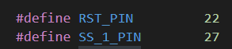

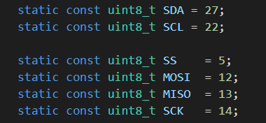


```c
#include <Arduino.h>
#include <WiFi.h>
#include <WiFiMulti.h>
#include <HTTPClient.h>
// #include <ESP8266WiFi.h>
// #include <ESP8266WiFiMulti.h>
// #include <ESP8266HTTPClient.h>
#include <WiFiClient.h>
#include <ArduinoJson.h>
#include <SPI.h>
#include <MFRC522.h>

#define RST_PIN         22          // Configurable, see typical pin layout above
#define SS_1_PIN        27         // Configurable, take a unused pin, only HIGH/LOW required, must be different to SS 2
#define SS_2_PIN        19          // Configurable, take a unused pin, only HIGH/LOW required, must be different to SS 1

#define NR_OF_READERS   2

byte ssPins[] = {SS_1_PIN, SS_2_PIN};

MFRC522 mfrc522 = MFRC522(SS_1_PIN, RST_PIN); // Create instance

#define MQ5PIN 32 // 可燃气
#define MQ2PIN 33 // 烟雾
#define ALART 2 // 报警
#define MOTOR 16 // 电机
#define KEY_PIN 18 // 按键
#define ssid "AVENGERS"
#define password "ASSEMBLE"
#define host "http://192.168.1.10:8511"
#define urlMQ2 host "/device/sensor/mq2Test/bb90f08378e54ee7a0a5f4b6e37c193a/updateSensorData?sensorData="
#define urlMQ5 host "/device/sensor/mq5Test/01b95f5404cd4de29b966101a6064f24/updateSensorData?sensorData="
#define urlAlart host "/device/alarm/alarmTest02/ba103ceb1bd848848e1744653fc0b8dd/getOrSetDeviceSwitchState?switchState="
#define urlRFID host "/device/other/RFID_RC522/e0e2287607d64acaa12c97efe3c1f891/getOrSetDeviceMultiSwitchState?switchState="
#define UUID_COUNT 3
#define UUID_LENGTH 4
byte UUIDS[UUID_COUNT][UUID_LENGTH] = {{0X43,0XB1,0X31,0X4C},{0X52,0XDF,0X7C,0X23},{0X01,0X04,0X4F,0XA6}};
int switchState = 0; // 0：关、1：开 、2：null
boolean switchFlag = false; // false: 关、true：开
boolean  beepFreqFlag = false;
WiFiMulti wifiMulti;
DynamicJsonDocument doc(1024);
void alarmOn(){
  Serial.println("light on\r\n");
  ledcWrite(ALART, 220);
  // ledcWrite(MOTOR, 800);
  digitalWrite(MOTOR, HIGH); // 电机
  switchFlag = true;
}
void alarmOff(){
  Serial.println("light off\r\n");
  ledcWrite(ALART, 0);
  // ledcWrite(MOTOR, 0);
  digitalWrite(MOTOR, LOW); // 电机
  switchFlag = false;
}

void ICACHE_FLASH_ATTR delay_ms(int C_time)
{  for(;C_time>0;C_time--)
  { ets_delay_us(1000);}
}

/* 外部中断 */ 
ICACHE_RAM_ATTR void highInterrupt(){
  detachInterrupt(KEY_PIN);
  int val = digitalRead(KEY_PIN);
  // if (val == 0){
    delay_ms(15);
    // val = digitalRead(KEY_PIN);
    if (val == 0)
    {
      Serial.print("highInterrupt\r\n");
      /* 将蜂鸣器的状态翻转 */
      if (switchFlag == true){
        // 让蜂鸣器关    
        alarmOff();
        switchState = 0;
        Serial.print("let light off\r\n");
      } else {
        // 让蜂鸣器开
        switchState = 1;
        Serial.print("let light on\r\n");
        alarmOn();
      } 
    // }
    
  }
  attachInterrupt(digitalPinToInterrupt(KEY_PIN), highInterrupt, FALLING);
  // ETS_GPIO_INTR_ENABLE();//打开中断
}

/**
 * @brief 给服务器发reques请求，可以设置设备状态，并返回
 * 
 * @param url 
 * @param deviceType // 1：传感器、2：报警器
 * @return boolean 
 */
boolean requestGet(String url, int deviceType){
    // wait for WiFi connection
    if ((wifiMulti.run() != WL_CONNECTED))
      return false;
    WiFiClient client;
    HTTPClient http;
    Serial.print("[HTTP] begin...\n");
    // configure traged server and url
  
    http.begin(client, url);
    Serial.print(url);
    Serial.print("[HTTP] GET...\n");
    // start connection and send HTTP header
    int httpCode = http.GET();
    if (httpCode > 0) {
      // HTTP header has been send and Server response header has been handled
      Serial.printf("[HTTP] GET... code: %d\n", httpCode);
      // file found at server
      if (httpCode == HTTP_CODE_OK) {
        String payload = http.getString();
        Serial.println(payload);
        DeserializationError error = deserializeJson(doc, payload);
        if (error){
          http.end();
          return false;
        }
        boolean flag = doc["flag"];
        if (flag){
          // 收到的数据无误
          http.end();
          boolean flag2 = doc["data"]["switchState"];
          // 设置开关
          if (flag2 && deviceType==2){
            // 开
            alarmOn();
          } else if(flag2==false && deviceType==2) {
            // 关  
            alarmOff();
          } 
          return true;
        } else {
          // 打印错误
          String errorMsg = doc["errorMsg"];
          Serial.print("error: ");
          Serial.print(errorMsg);
          Serial.print("\r\n");
          http.end();
          return false;
        }
      }
    } else {
      Serial.printf("[HTTP] GET... failed, error: %s\n", http.errorToString(httpCode).c_str());
    }
    http.end();
    return false;
}

boolean requestGetMultiSwitch(String url){
    // wait for WiFi connection
    if ((wifiMulti.run() != WL_CONNECTED))
      return false;
    WiFiClient client;
    HTTPClient http;
    Serial.print("[HTTP] begin...\n");
    // configure traged server and url
  
    http.begin(client, url);
    Serial.print(url);
    Serial.print("[HTTP] GET...\n");
    // start connection and send HTTP header
    int httpCode = http.GET();
    if (httpCode > 0) {
      // HTTP header has been send and Server response header has been handled
      Serial.printf("[HTTP] GET... code: %d\n", httpCode);
      // file found at server
      if (httpCode == HTTP_CODE_OK) {
        String payload = http.getString();
        Serial.println(payload);
        DeserializationError error = deserializeJson(doc, payload);
        if (error){
          http.end();
          return false;
        }
        boolean flag = doc["flag"];
        if (flag){
          // 收到的数据无误
          http.end();
          
          return true;
        } else {
          // 打印错误
          String errorMsg = doc["errorMsg"];
          Serial.print("error: ");
          Serial.print(errorMsg);
          Serial.print("\r\n");
          http.end();
          return false;
        }
      }
    } else {
      Serial.printf("[HTTP] GET... failed, error: %s\n", http.errorToString(httpCode).c_str());
    }
    http.end();
    return false;
}


void dump_byte_array(byte *buffer, byte bufferSize) {
  for (byte i = 0; i < bufferSize; i++) {
    Serial.print(buffer[i] < 0x10 ? " 0" : " ");
    Serial.print(buffer[i], HEX);
  }
}

void setup() {
  // put your setup code here, to run once:
  Serial.begin(115200);
  /* 外部中断引脚初始化：GPIO0(下拉) */
  pinMode(KEY_PIN,INPUT_PULLUP); // 设置外置按钮管脚为上拉输入模式
  attachInterrupt(digitalPinToInterrupt(KEY_PIN), highInterrupt, FALLING); // 设置外置按钮管脚中断为上升沿触发模式
  /* wifi 初始化 */
  WiFi.mode(WIFI_STA);
  wifiMulti.addAP(ssid, password);
  /* 传感器初始化 */
  analogSetWidth(12);
  /* 蜂鸣器初始化 */
  pinMode(ALART,OUTPUT);
  ledcSetup(2,4000,10);
  ledcAttachPin(ALART,2);
  /* motor初始化 */
  pinMode(MOTOR, OUTPUT);
  // ledcSetup(4,4000,10);
  // ledcAttachPin(MOTOR,4);

  SPI.begin();        // Init SPI bus

  mfrc522.PCD_Init();

  mfrc522.PCD_DumpVersionToSerial();  
}
void loop() {
  // // put your main code here, to run repeatedly:
  String urlAlartTemp;
  // /* 读取传感器 */
  int mq5 = analogRead(MQ5PIN);
  int mq2 = analogRead(MQ2PIN);
  Serial.print("mq5: ");
  Serial.print(mq5 / 40.96);
  Serial.print("%; mq2: ");
  Serial.print(mq2 / 40.96);
  Serial.print("%\r\n");
  requestGet(urlMQ2 + String(mq2 / 40.96), 1);
  requestGet(urlMQ5 + String(mq5 / 40.96), 1);
  /* 蜂鸣器 */
  if (switchFlag){
  // 如果蜂鸣器响了，每秒更改蜂鸣器频率
    if (beepFreqFlag){
      ledcWriteTone(2,4000);
      beepFreqFlag = false;
    } else {
      ledcWriteTone(2,3500);
      beepFreqFlag = true;  
    }
  }
    if (switchState == 1){
      urlAlartTemp = String(urlAlart) + String("true");
      // http.begin(client, url + String("true"));
      switchState = 2;
    }else if (switchState == 0){
      urlAlartTemp = String(urlAlart) + String("false");
      // http.begin(client, url + String("flase"));
      switchState = 2;
    }else if (switchState == 2) {
      // null
      // http.begin(client, url);
      urlAlartTemp = String(urlAlart);
    }  
  requestGet(urlAlartTemp, 2);
  // ledcWrite(ALART, 220);

    if (mfrc522.PICC_IsNewCardPresent() && mfrc522.PICC_ReadCardSerial()) {
      Serial.print(F("Reader "));
      // Show some details of the PICC (that is: the tag/card)
      Serial.print(F(": Card UID:"));
      // 判断UUID是否属于数据库
      dump_byte_array(mfrc522.uid.uidByte, mfrc522.uid.size);
      for (int i = 0; i < UUID_COUNT; i++)
      {
        uint8_t count = 0;
        for (int j = 0; j < mfrc522.uid.size; j++)
        {
          // printf("myuuid: %x ; inputuuid: %x; \r\n", *UUIDS[j], mfrc522.uid.uidByte[j]);
          if (UUIDS[i][j] == mfrc522.uid.uidByte[j])
          {
            // Serial.print("wellcom tony.\r\n");
            count += 1;
          }else{
            // Serial.print("unknow card.\r\n");
            continue;
          }
        }
        if (count == mfrc522.uid.size)
        {
          // 芝麻开门
          requestGetMultiSwitch(SString(urlRFID) + String(1));
        }
      }
      Serial.println();
      Serial.print(F("PICC type: "));
      MFRC522::PICC_Type piccType = mfrc522.PICC_GetType(mfrc522.uid.sak);
      Serial.println(mfrc522.PICC_GetTypeName(piccType));
      // Halt PICC
      mfrc522.PICC_HaltA();
      // Stop encryption on PCD
      mfrc522.PCD_StopCrypto1();
      delay(1200);
  }
}
```

# 入户门舵机程序

```c
#include <Adafruit_NeoPixel.h>
#include <Arduino.h>
#include <ESP8266WiFi.h>
#include <ESP8266WiFiMulti.h>
#include <ESP8266HTTPClient.h>
#include <WiFiClient.h>
#include <ArduinoJson.h>
#define BODYSENSOR_PIN 0
#define DUOJI_PIN 2
#define ssid "AVENGERS"
#define password "ASSEMBLE"
#define host "http://192.168.1.10:8511"
#define urlBodySensor host "/device/sensor/bodySensor/bc843d2ceda64bdd99a1f55b6c706aa7/updateSensorData?sensorData="
#define urlDuoji host "/device/other/duoji/6fbca216f9a14f639152d4d08ac1272b/getOrSetDeviceMultiSwitchState?switchState="
int currentModeIndex = 0;
// 0常关；1常开；2开后延迟6秒关
bool isReadyToChangeSwitchState = true;
uint8_t currentBodySensorData;
uint8_t preBodySensorData;
ESP8266WiFiMulti WiFiMulti;
DynamicJsonDocument doc(1024);

void closeDoor(){
  analogWrite(DUOJI_PIN, 30);
  
}

void openDoor(){
  analogWrite(DUOJI_PIN, 15);
}

void delayClose(){
  openDoor();
  delay(6000);
  closeDoor();  
}

void setMode(int index){
  // 判断是否和现在的状态一样
  // 一样：return
  // 不一样：执行
  if (currentModeIndex == index)
    return;
  currentModeIndex = index;
  if(index == 0){
      closeDoor();  
  }else if(index == 1){
      openDoor();
  }else if(index == 2){
      delayClose();
      currentModeIndex = 0; // 门关
      isReadyToChangeSwitchState = true;
  }
}

void keepConnected(){
  if ((WiFiMulti.run() == WL_CONNECTED)) {
    WiFiClient client;
    HTTPClient http;
    Serial.print("[HTTP] begin...\n");
    // configure traged server and url
    if(isReadyToChangeSwitchState){
      http.begin(client, String(urlDuoji) + String(currentModeIndex)); 
      isReadyToChangeSwitchState = false;  
    }else{
      http.begin(client, String(urlDuoji));    
    }
    Serial.print("[HTTP] GET...\n");
    // start connection and send HTTP header
    int httpCode = http.GET();
    if (httpCode > 0) {
      // HTTP header has been send and Server response header has been handled
      Serial.printf("[HTTP] GET... code: %d\n", httpCode);
      // file found at server
      if (httpCode == HTTP_CODE_OK) {
        String payload = http.getString();
        Serial.println(payload);
        DeserializationError error = deserializeJson(doc, payload);
        if (error)
          return;
        boolean flag = doc["flag"];
        if (flag){
          // 收到的数据无误
          int multiSwitchState = doc["data"]["multiSwitchState"];
          // 设置门的开关
          if (multiSwitchState >=0 && multiSwitchState <=2)
            Serial.printf("multiSwitchState=%d \r\n", multiSwitchState);
            setMode(multiSwitchState);
        } else {
          // 打印错误
          String errorMsg = doc["errorMsg"];
          Serial.print("error: ");
          Serial.print(errorMsg);
          Serial.print("\r\n");
        }
      }
    } else {
      Serial.printf("[HTTP] GET... failed, error: %s\n", http.errorToString(httpCode).c_str());
    }
    http.end();
  }
}


boolean requestGet(String url){
    // wait for WiFi connection
    if ((WiFiMulti.run() != WL_CONNECTED))
      return false;
    WiFiClient client;
    HTTPClient http;
    Serial.print("[HTTP] begin...\n");
    // configure traged server and url
    http.begin(client, url);
    Serial.print(url);
    Serial.print("[HTTP] GET...\n");
    // start connection and send HTTP header
    int httpCode = http.GET();
    if (httpCode > 0) {
      // HTTP header has been send and Server response header has been handled
      Serial.printf("[HTTP] GET... code: %d\n", httpCode);
      // file found at server
      if (httpCode == HTTP_CODE_OK) {
        String payload = http.getString();
        Serial.println(payload);
        DeserializationError error = deserializeJson(doc, payload);
        if (error){
          http.end();
          return false;
        }
        boolean flag = doc["flag"];
        if (flag){
          // 收到的数据无误
          http.end();
          return true;
        } else {
          // 打印错误
          String errorMsg = doc["errorMsg"];
          Serial.print("error: ");
          Serial.print(errorMsg);
          Serial.print("\r\n");
          http.end();
          return false;
        }
      }
    } else {
      Serial.printf("[HTTP] GET... failed, error: %s\n", http.errorToString(httpCode).c_str());
    }
    http.end();
    return false;
}


void setup() {
    // This initializes the NeoPixel library.
    Serial.begin(115200);
    WiFi.mode(WIFI_STA);
    WiFiMulti.addAP(ssid, password);
    pinMode(BODYSENSOR_PIN, INPUT);
    preBodySensorData = digitalRead(BODYSENSOR_PIN);
    // 舵机
    analogWriteFreq(50);
    closeDoor();
}

void loop() {    

    // 判断当前状态，如果为1，再次判断是否和上一个状态是否一样，一样则不发送请求
    // 判断当前状态，如果为0，直接发送请求
    currentBodySensorData = digitalRead(BODYSENSOR_PIN);
    if (currentBodySensorData == 1){
      if (currentBodySensorData != preBodySensorData){
            requestGet(urlBodySensor + String(currentBodySensorData));      
        }
    }else{
        requestGet(urlBodySensor + String(currentBodySensorData));      
    }
    preBodySensorData = digitalRead(BODYSENSOR_PIN);
    Serial.printf("bodySensorData=%d; \r\n", currentBodySensorData);
//    requestGet(urlBodySensor + String(humidity));
    
    keepConnected(); // 舵机保持运行
    delay(1000);

}
```


# python 获取服务器视频流 进行人脸识别

```python
import urllib.request
import cv2
import os
import requests
from queue import Queue
import threading
import time
import numpy as np
boundary = b"------WebKitFormBoundary7MA4YWxkTrZu0gW\r\nContent-Type: image/jpeg\r\n\r\n"

# 加载训练数据集文件
recognizer = cv2.face.LBPHFaceRecognizer_create()
# 加载数据
recognizer.read("trainer/trainer.yml")
# 名称
names = []
# 警报全局变量
warningTime = 0


# videoBuf = Queue(maxsize=2)
videoStreamFrame = b""

def bytes2cv(im):
    '''二进制图片转cv2

    :param im: 二进制图片数据，bytes
    :return: cv2图像，numpy.ndarray
    '''
    return cv2.imdecode(np.array(bytearray(im), dtype='uint8'), cv2.IMREAD_UNCHANGED)  # 从二进制图片数据中读取

def retriveFrame(buff):
    global videoStreamFrame
    index = buff.find(boundary)

    # 当前读取到的buff还未到达分割点
    if index == -1:
        return buff

    # 以boundary为界，分割出帧
    videoStreamFrame = buff[0 : index]
    # if videoBuf.full():
        # videoBuf.get_nowait()
    # videoBuf.put(frame)

    # 保留解析出帧后，剩余的部分
    # 供下次解析
    return buff[index + len(boundary):]


def getVideoStream():
    headers = {
            "Connection": "keep-alive",
            "Accept": "image/avif,image/webp,image/apng,image/svg+xml,image/*,*/*;q=0.8",
            "Sec-Fetch-Site": "same-origin",
            "Sec-Fetch-Mode": "no-cors",
            "Sec-Fetch-Dest": "image",
            "Accept-Encoding": "gzip, deflate, br",
            "Accept-Language": "zh-CN,zh;q=0.9",
            "token": "tonystonkenlalala"
    }
    # url = "http://localhost:8511/device/camera/espCam/2863624987774568b5e98e0f915f9bd8/getVideoStream?time=1644797769908";
    url = "http://localhost:8511/device/camera/laptopCamera/1a9d7bcf183f46eebbd5ca4fe580efca/getVideoStream?time=1644826032363";
    res = requests.get(url, headers=headers, stream=True)
    streamImage = b''
    
    print("start: ")
    s = time.time()
    
    for byte in res.iter_content(500):
        streamImage += byte
        streamImage = retriveFrame(streamImage);
        
    print("time = " + str(time.time()-s))
    

# 报警模块
def warning():
    print("警报!!!")
# 不断获取网络摄像头图片，放入缓冲区
# 1秒播放30张图片，且进行处理
# 缓冲区没
def getVideoImage(capture):
    flag, frame = capture.read()
    images_buffer.append((flag, frame));

# 准备识别图片
def face_detect_demo(img):
    gray = cv2.cvtColor(img, cv2.COLOR_BGR2GRAY)
    face_detector = cv2.CascadeClassifier("D:/python/Lib/site-packages/cv2/data/haarcascade_frontalface_alt2.xml")
    face = face_detector.detectMultiScale(gray)
    for x,y,w,h in face:
        cv2.rectangle(img, (x,y), (x+w, y+h), color=(0,0,255), thickness=2)
        # cv2.circle(img, center=(x+w//22, y+h//2), radius=w//2, color=(0, 255, 0), thickness=1)
        # 人脸识别
        ids, confidence = recognizer.predict(gray[y:y + h, x:x + w])
        # print(ids)
        if confidence > 80:
            global warningTime
            warningTime += 1
            if warningTime > 100:
                warning()
                warningTime = 0
            cv2.putText(img, "unknow", (x+10, y-10), cv2.FONT_HERSHEY_SIMPLEX, 0.75, (0, 255, 0), 1)
        else:
            cv2.putText(img, "Tony", (x+10, y-10), cv2.FONT_HERSHEY_SIMPLEX, 0.75, (0, 255, 0), 1)
    return img


def getBuffer():
    while True:
        getVideoStream()
    
t = threading.Thread(target=getBuffer)
t.start()

if __name__ == "__main__":
    while True:
        if videoStreamFrame == b"":
            continue
        frame = bytes2cv(videoStreamFrame)
        frame = face_detect_demo(frame)
        cv2.imshow("face_detector", frame)
        key = cv2.waitKey(1) & 0xFF
        if key == ord(' '):
            break

```

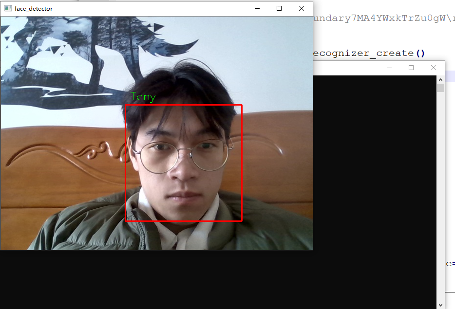


# python上报视频流代码

```python
import requests
import cv2
url = "http://localhost:8511/device/camera/laptopCamera/1a9d7bcf183f46eebbd5ca4fe580efca/uploadVideoStream"
capture = cv2.VideoCapture(0)
while True:
    flag, frame = capture.read()
    if flag:
        bs = cv2.imencode(".jpg",frame)[1].tobytes()
        files = {'file': bs}
        requests.post(url, files=files)
        
        
```


# 步进电机开门 驱动代码

```c
#include <Adafruit_NeoPixel.h>
#include <Arduino.h>
#include <ESP8266WiFi.h>
#include <ESP8266WiFiMulti.h>
#include <ESP8266HTTPClient.h>
#include <WiFiClient.h>
#include <ArduinoJson.h>
#define ssid "AVENGERS"
#define password "ASSEMBLE"
#define host "http://192.168.1.10:8511"
#define urlStepMotor host "/device/other/stepMotor/30cfad3b9f874a15b4c14a5322421044/getOrSetDeviceMultiSwitchState?switchState="
#define MOTOR_A 0 // gpio0
#define MOTOR_B 1 // TX
#define MOTOR_C 2 // gpio2
#define MOTOR_D 3 // rx
int currentModeIndex = 0;
// 0常关；1常开；2开后延迟6秒关
bool isReadyToChangeSwitchState = false;
// 逆时针相序
uint8_t CCW[8] = {0X08,0X0C,0X04,0X06,0X02,0X03,0X01,0X09};
// 顺时针相序
uint8_t CW[8] = {0X09,0X01,0X03,0X02,0X06,0X04,0X0C,0X08};
// TX - gpio1
// px = gpio3

ESP8266WiFiMulti WiFiMulti;
DynamicJsonDocument doc(1024);

void motorInit(void){
  pinMode(MOTOR_A, OUTPUT);
  pinMode(MOTOR_B, OUTPUT);
  pinMode(MOTOR_C, OUTPUT);
  pinMode(MOTOR_D, OUTPUT);
}

void reset_raozu(void){
  digitalWrite(MOTOR_A, LOW);
  digitalWrite(MOTOR_B, LOW);
  digitalWrite(MOTOR_C, LOW);
  digitalWrite(MOTOR_D, LOW);
}

// 设置哪个绕组通电
void set_raozu(uint8_t code){
  switch(code){
    case 0x08:
      digitalWrite(MOTOR_A, HIGH);
      digitalWrite(MOTOR_B, LOW);
      digitalWrite(MOTOR_C, LOW);
      digitalWrite(MOTOR_D, LOW);
      break;
    case 0x0C:
      digitalWrite(MOTOR_A, HIGH);
      digitalWrite(MOTOR_B, HIGH);
      digitalWrite(MOTOR_C, LOW);
      digitalWrite(MOTOR_D, LOW);
      break;
    case 0x04:
      digitalWrite(MOTOR_A, LOW);
      digitalWrite(MOTOR_B, HIGH);
      digitalWrite(MOTOR_C, LOW);
      digitalWrite(MOTOR_D, LOW);
      break;
    case 0x06:
      digitalWrite(MOTOR_A, LOW);
      digitalWrite(MOTOR_B, HIGH);
      digitalWrite(MOTOR_C, HIGH);
      digitalWrite(MOTOR_D, LOW);
      break;
    case 0x02:
      digitalWrite(MOTOR_A, LOW);
      digitalWrite(MOTOR_B, LOW);
      digitalWrite(MOTOR_C, HIGH);
      digitalWrite(MOTOR_D, LOW);
      break;
    case 0x03:
      digitalWrite(MOTOR_A, LOW);
      digitalWrite(MOTOR_B, LOW);
      digitalWrite(MOTOR_C, HIGH);
      digitalWrite(MOTOR_D, HIGH);
      break;
    case 0x01:
      digitalWrite(MOTOR_A, LOW);
      digitalWrite(MOTOR_B, LOW);
      digitalWrite(MOTOR_C, LOW);
      digitalWrite(MOTOR_D, HIGH);
      break;
    case 0x09:
      digitalWrite(MOTOR_A, HIGH);
      digitalWrite(MOTOR_B, LOW);
      digitalWrite(MOTOR_C, LOW);
      digitalWrite(MOTOR_D, HIGH);
      break;
  }
}


void motor_angle(int angle, int orientation, int speed){
  int i;
  int j, times;
  times = angle / 0.7035;

  if(orientation){
    for(j=0; j<times; j++){
      for(i=0;i<8;i++)// 旋转0.7035°
       {
         set_raozu(CCW[i]);
          delay(1); 
//         delayMicroseconds(950);
         delayMicroseconds(speed); 
       }
   }
  }else{
    for(j=0; j<times; j++){
      //printf("j");
      for(i=0;i<8;i++)// 旋转0.7035°
       {
         set_raozu(CW[i]);
          delay(1);
//         delayMicroseconds(950);
         delayMicroseconds(speed);
         //printf("i");
       }
   }
  }
  reset_raozu();
}

void closeDoor(){
  motor_angle(95, 1, 1);
}

void openDoor(){
  motor_angle(95, 0, 1);
}

void delayClose(){
  openDoor();
  delay(6000);
  closeDoor();  
}

void setMode(int index){
  // 判断是否和现在的状态一样
  // 一样：return
  // 不一样：执行
  if (currentModeIndex == index)
    return;
  currentModeIndex = index;
  if(index == 0){
      closeDoor();  
  }else if(index == 1){
      openDoor();
  }else if(index == 2){
      delayClose();
      currentModeIndex = 0; // 门关
      isReadyToChangeSwitchState = true;
  }
}


void keepConnected(){
  if ((WiFiMulti.run() == WL_CONNECTED)) {
    WiFiClient client;
    HTTPClient http;
//    Serial.print("[HTTP] begin...\n");
    // configure traged server and url
    if(isReadyToChangeSwitchState){
      http.begin(client, String(urlStepMotor) + String(currentModeIndex)); 
      isReadyToChangeSwitchState = false;  
    }else{
      http.begin(client, String(urlStepMotor));    
    }
//    Serial.print("[HTTP] GET...\n");
    // start connection and send HTTP header
    int httpCode = http.GET();
    if (httpCode > 0) {
      // HTTP header has been send and Server response header has been handled
//      Serial.printf("[HTTP] GET... code: %d\n", httpCode);
      // file found at server
      if (httpCode == HTTP_CODE_OK) {
        String payload = http.getString();
//        Serial.println(payload);
        DeserializationError error = deserializeJson(doc, payload);
        if (error)
          return;
        boolean flag = doc["flag"];
        if (flag){
          // 收到的数据无误
          int multiSwitchState = doc["data"]["multiSwitchState"];
          // 设置门的开关
          if (multiSwitchState >=0 && multiSwitchState <=2)
//            Serial.printf("multiSwitchState=%d \r\n", multiSwitchState);
            setMode(multiSwitchState);
        } else {
          // 打印错误
          String errorMsg = doc["errorMsg"];
//          Serial.print("error: ");
//          Serial.print(errorMsg);
//          Serial.print("\r\n");
        }
      }
    } else {
//      Serial.printf("[HTTP] GET... failed, error: %s\n", http.errorToString(httpCode).c_str());
    }
    http.end();
  }
}

void setup() {
//  Serial.begin(115600);
  // put your setup code here, to run once:
    WiFi.mode(WIFI_STA);
    WiFiMulti.addAP(ssid, password);

    motorInit();
}

void loop() {
  // put your main code here, to run repeatedly:
  keepConnected();
  delay(1000);
}
```

